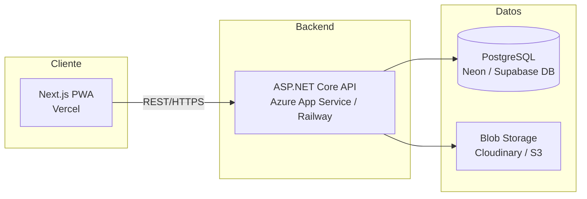
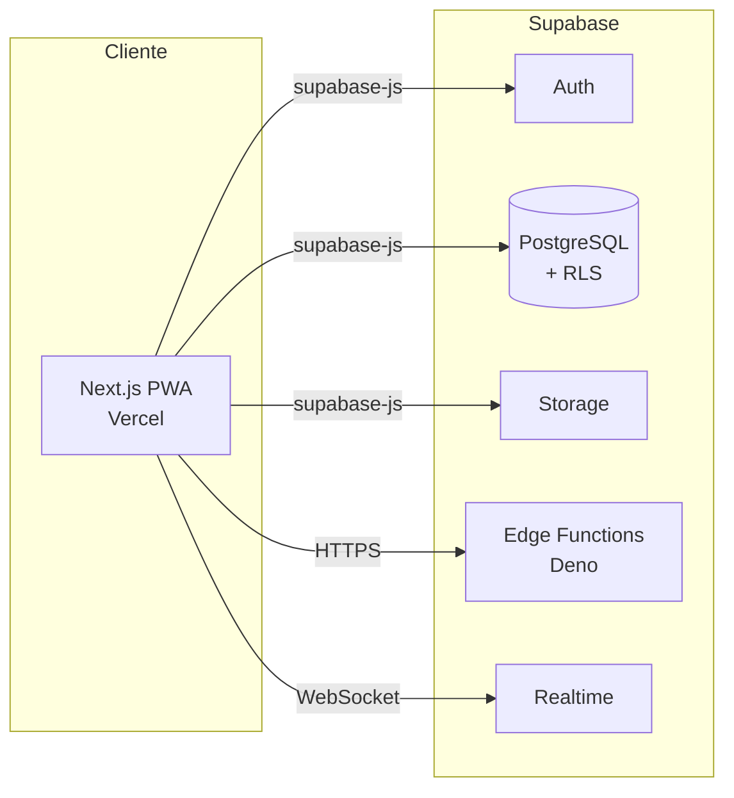
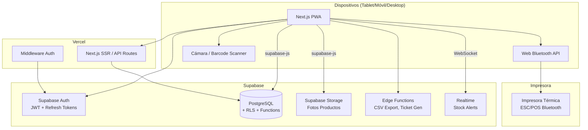
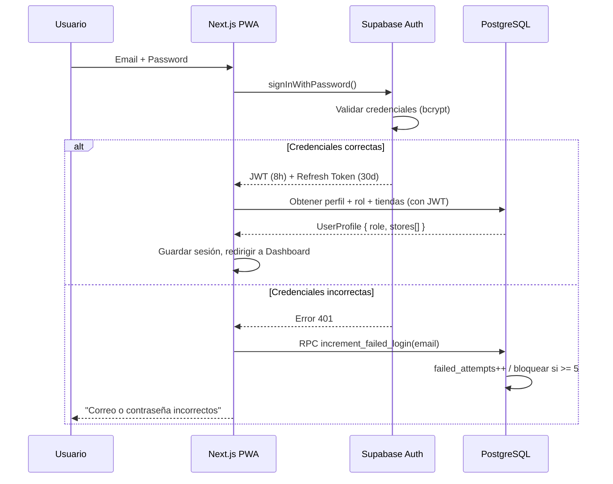
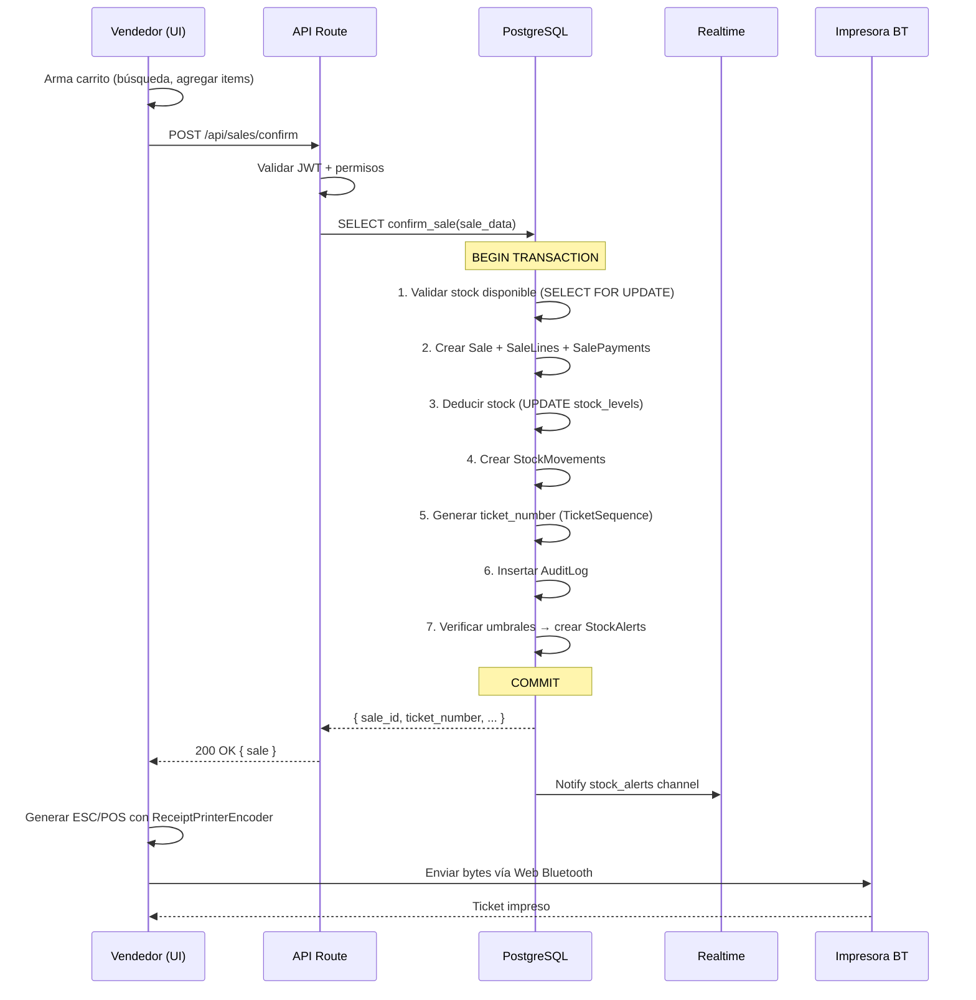
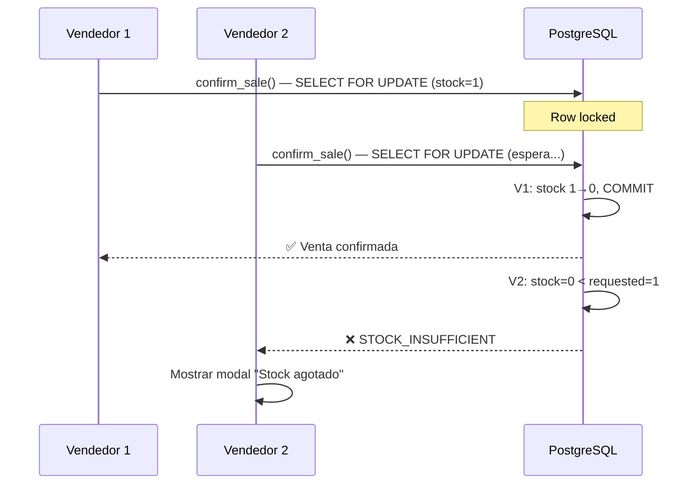
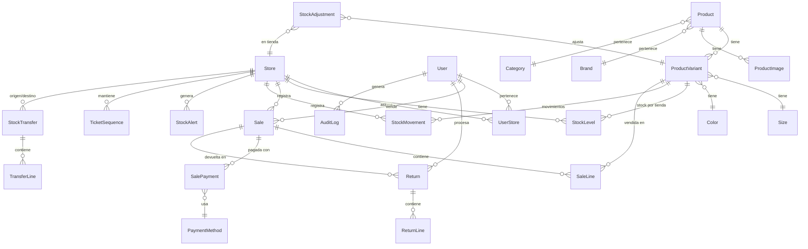
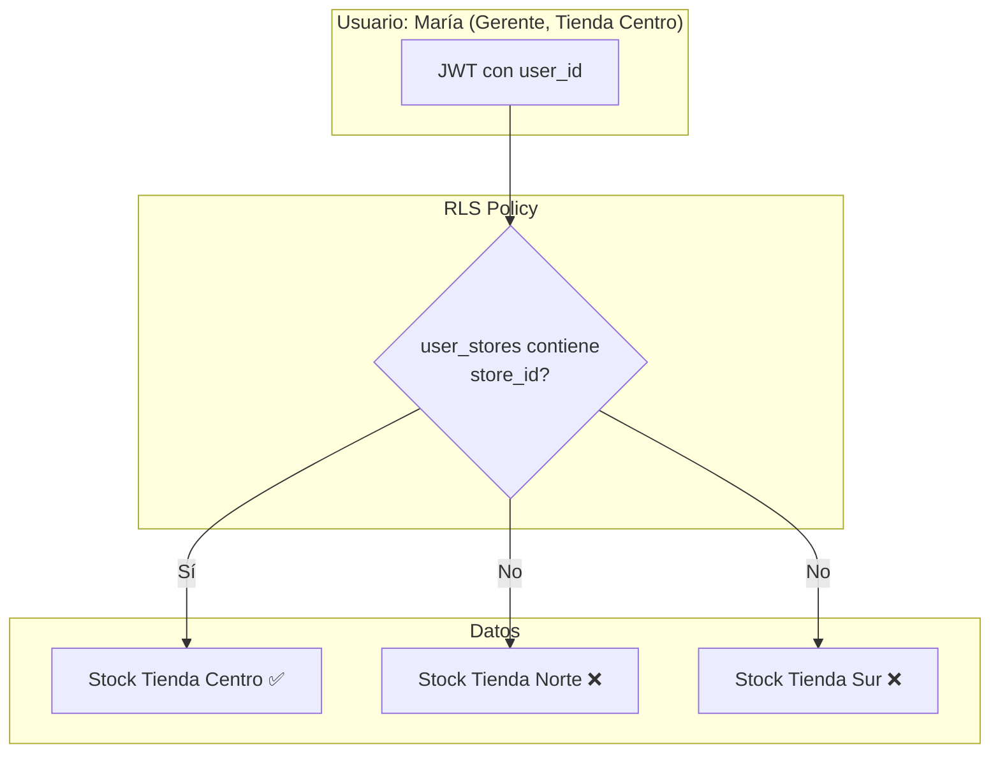
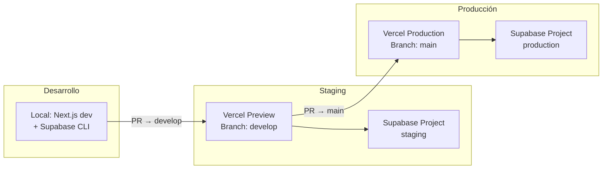
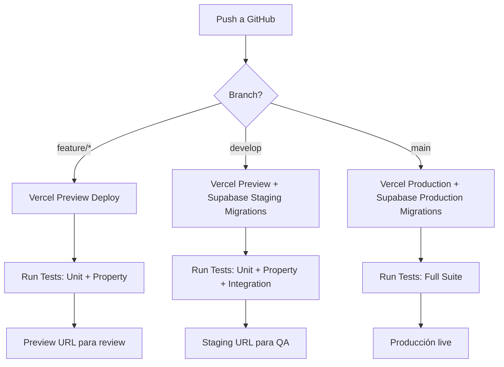

# Documento de Diseño — ShoeStore POS & Inventario

---

## 1. Visión General (Overview)

Este documento de diseño define la arquitectura técnica, componentes, interfaces, modelo de datos y estrategia de implementación para el sistema **ShoeStore POS & Inventario**: una aplicación web en la nube para una cadena de 3 tiendas de calzado.

El sistema cubre dos dominios funcionales principales:
- **Gestión de Inventario**: stock por tienda/variante, movimientos auditados, transferencias, alertas, kardex.
- **Punto de Venta (POS)**: flujo de venta rápido, descuentos, impuestos (IVA), impresión térmica Bluetooth, devoluciones.

### Decisiones Clave de Diseño

1. **Arquitectura seleccionada**: Opción B — Next.js + Supabase (BaaS) para el MVP, con migración posible a .NET en Fase 2 si se requiere.
2. **Base de datos**: PostgreSQL (vía Supabase) con Row Level Security (RLS) para aislamiento por tienda.
3. **Impresión**: Web Bluetooth API + `ReceiptPrinterEncoder` como canal principal, con fallback a generación de PDF.
4. **Despliegue**: Vercel (frontend) + Supabase (backend/DB/storage/auth) — ambos en tier gratuito para MVP.

---

## 2. Comparación de Arquitecturas

Se evaluaron dos opciones de arquitectura según los requisitos del proyecto.

### Opción A: React/Next.js + ASP.NET Core API + PostgreSQL + Storage



**Componentes:**
- **Frontend**: Next.js en Vercel (SSR + CSR)
- **Backend**: ASP.NET Core 8 Web API desplegado en Azure App Service (Free tier F1) o Railway ($5/mes)
- **Base de datos**: PostgreSQL en Neon (free: 0.5 GB) o Supabase (free: 500 MB)
- **Storage**: Cloudinary (free: 25 créditos/mes) o Supabase Storage (free: 1 GB)
- **Auth**: ASP.NET Identity + JWT

**Pros:**
- Control total sobre la lógica de negocio en el backend
- Tipado fuerte con C# — ideal para reglas complejas (cálculos de IVA, concurrencia de stock)
- Entity Framework Core para migraciones y ORM robusto
- Ecosistema maduro para testing (xUnit, NSubstitute)
- Fácil de escalar horizontalmente con contenedores

**Contras:**
- Requiere mantener y desplegar un servicio backend separado
- Azure Free tier F1: limitado a 60 min CPU/día, 1 GB RAM, sin custom domain SSL
- Mayor complejidad operativa (CI/CD para 2 servicios)
- Cold starts en tier gratuito (~5-10 segundos)
- Costo estimado MVP: $0-5/mes (free tiers) → $25-50/mes en producción real

### Opción B: React/Next.js + Supabase (BaaS) — **RECOMENDADA**



**Componentes:**
- **Frontend**: Next.js en Vercel (SSR + API Routes para lógica sensible)
- **Backend**: Supabase (PostgreSQL + Auth + Storage + Edge Functions + Realtime)
- **Lógica de negocio**: Combinación de:
  - **Database Functions (PL/pgSQL)**: operaciones atómicas críticas (confirmar venta, transferir stock)
  - **Edge Functions (Deno/TypeScript)**: lógica compleja que no cabe en SQL (generación de tickets, exportación CSV)
  - **Next.js API Routes**: endpoints que requieren server-side rendering o integración con servicios externos
- **Auth**: Supabase Auth (email/password, JWT automático)
- **Storage**: Supabase Storage (fotos de productos)
- **Realtime**: Supabase Realtime (alertas de stock en tiempo real)

**Pros:**
- Un solo proveedor para DB + Auth + Storage + Functions + Realtime
- PostgreSQL nativo con acceso directo — sin abstracción NoSQL
- Row Level Security (RLS) para aislamiento por tienda integrado
- Auth con JWT incluido, sin implementación manual
- Tier gratuito generoso: 500 MB DB, 1 GB storage, 50K MAU, 500K Edge Function invocations
- Menor complejidad operativa — un solo dashboard
- Realtime subscriptions para alertas de stock sin polling
- Costo estimado MVP: $0/mes → $25/mes (Pro) cuando se necesite

**Contras:**
- Lógica de negocio distribuida entre PL/pgSQL, Edge Functions y API Routes
- Edge Functions tienen cold starts (~200-500ms)
- Vendor lock-in parcial (mitigable: PostgreSQL estándar, lógica en funciones portables)
- Menos control sobre el runtime del backend
- Testing de funciones PL/pgSQL requiere herramientas específicas (pgTAP)

### Tabla Comparativa de Costos

| Concepto | Opción A (.NET) | Opción B (Supabase) |
|----------|----------------|---------------------|
| Frontend (Vercel Hobby) | $0 | $0 |
| Backend hosting | $0-5 (Azure F1 / Railway trial) | $0 (incluido en Supabase) |
| Base de datos | $0 (Neon free 0.5GB) | $0 (Supabase free 500MB) |
| Storage fotos | $0 (Cloudinary free) | $0 (Supabase Storage 1GB) |
| Auth | Implementación propia | $0 (incluido) |
| Realtime | Implementación propia (SignalR) | $0 (incluido) |
| **Total MVP** | **$0-5/mes** | **$0/mes** |
| **Total Producción** | **$30-60/mes** | **$25/mes** (Pro) |

### Decisión: Opción B (Supabase)

**Justificación:**
1. **Velocidad de desarrollo**: Un solo SDK (`supabase-js`) para DB, Auth, Storage y Realtime reduce drásticamente el tiempo de desarrollo del MVP.
2. **Costo**: $0 para MVP, $25/mes para producción — significativamente menor que mantener un backend .NET separado.
3. **PostgreSQL nativo**: No sacrificamos la base de datos relacional. Podemos usar transacciones, funciones PL/pgSQL, triggers y RLS.
4. **Operaciones atómicas**: Las funciones PL/pgSQL garantizan atomicidad en operaciones críticas (confirmar venta + deducir stock + generar ticket) sin necesidad de un ORM.
5. **Migración futura**: Si en Fase 2 se necesita un backend .NET, la base de datos PostgreSQL y la lógica PL/pgSQL son 100% portables.
6. **Escala adecuada**: 3 tiendas, ~15 usuarios concurrentes, ~5000 variantes — Supabase free/Pro maneja esto sin problemas.

---

## 3. Arquitectura

### 3.1 Diagrama de Arquitectura General



### 3.2 Capas de la Aplicación

```
┌─────────────────────────────────────────────────────────┐
│  CAPA DE PRESENTACIÓN (Next.js + React)                 │
│  ├── Pages / App Router                                  │
│  ├── Componentes UI (Shadcn/ui + Tailwind CSS)          │
│  ├── Estado global (Zustand)                             │
│  ├── Hooks personalizados                                │
│  └── Servicio de impresión (Web Bluetooth + ESC/POS)    │
├─────────────────────────────────────────────────────────┤
│  CAPA DE ACCESO A DATOS (Supabase Client)               │
│  ├── supabase-js SDK                                     │
│  ├── React Query (TanStack Query) para cache/sync       │
│  ├── Tipos TypeScript generados (supabase gen types)    │
│  └── Helpers de consulta tipados                         │
├─────────────────────────────────────────────────────────┤
│  CAPA DE LÓGICA DE NEGOCIO                              │
│  ├── Next.js API Routes (validación, orquestación)      │
│  ├── Supabase Edge Functions (CSV, reportes)            │
│  └── PostgreSQL Functions (operaciones atómicas)         │
├─────────────────────────────────────────────────────────┤
│  CAPA DE DATOS (Supabase / PostgreSQL)                  │
│  ├── Tablas con RLS policies                             │
│  ├── Triggers (auditoría, alertas)                       │
│  ├── Funciones PL/pgSQL (venta, transferencia, ajuste)  │
│  └── Índices optimizados                                 │
└─────────────────────────────────────────────────────────┘
```

### 3.3 Flujo de Autenticación



### 3.4 Flujo de Venta (Operación Crítica)



---

## 4. Componentes e Interfaces

### 4.1 Estructura del Proyecto

```
shoe-store-pos/
├── src/
│   ├── app/                          # Next.js App Router
│   │   ├── (auth)/
│   │   │   └── login/page.tsx
│   │   ├── (dashboard)/
│   │   │   ├── layout.tsx            # Layout con sidebar + topbar
│   │   │   ├── page.tsx              # Dashboard
│   │   │   ├── pos/page.tsx          # Punto de Venta
│   │   │   ├── catalogo/
│   │   │   │   ├── productos/
│   │   │   │   │   ├── page.tsx      # Lista productos
│   │   │   │   │   ├── nuevo/page.tsx
│   │   │   │   │   └── [id]/
│   │   │   │   │       ├── page.tsx  # Detalle
│   │   │   │   │       └── editar/page.tsx
│   │   │   │   ├── categorias/page.tsx
│   │   │   │   └── marcas/page.tsx
│   │   │   ├── inventario/
│   │   │   │   ├── stock/page.tsx
│   │   │   │   ├── movimientos/page.tsx
│   │   │   │   ├── ajustes/nuevo/page.tsx
│   │   │   │   ├── transferencias/
│   │   │   │   │   ├── page.tsx
│   │   │   │   │   └── nueva/page.tsx
│   │   │   │   └── alertas/page.tsx
│   │   │   ├── ventas/
│   │   │   │   ├── historial/page.tsx
│   │   │   │   ├── [id]/page.tsx
│   │   │   │   └── devoluciones/
│   │   │   │       ├── page.tsx
│   │   │   │       └── nueva/page.tsx
│   │   │   ├── usuarios/page.tsx
│   │   │   ├── config/
│   │   │   │   ├── tiendas/page.tsx
│   │   │   │   ├── impuestos/page.tsx
│   │   │   │   ├── metodos-pago/page.tsx
│   │   │   │   ├── ticket/page.tsx
│   │   │   │   └── impresoras/page.tsx
│   │   │   ├── auditoria/page.tsx
│   │   │   └── perfil/page.tsx
│   │   └── api/
│   │       ├── sales/
│   │       │   ├── confirm/route.ts
│   │       │   └── void/route.ts
│   │       ├── returns/
│   │       │   └── process/route.ts
│   │       ├── inventory/
│   │       │   ├── adjust/route.ts
│   │       │   └── transfer/route.ts
│   │       ├── export/
│   │       │   └── csv/route.ts
│   │       └── auth/
│   │           └── callback/route.ts
│   ├── components/
│   │   ├── ui/                       # Shadcn/ui components
│   │   ├── pos/
│   │   │   ├── SearchBar.tsx
│   │   │   ├── ProductCard.tsx
│   │   │   ├── Cart.tsx
│   │   │   ├── CartLine.tsx
│   │   │   ├── DiscountModal.tsx
│   │   │   ├── PaymentSelector.tsx
│   │   │   ├── SaleConfirmation.tsx
│   │   │   └── BarcodeScanner.tsx
│   │   ├── catalog/
│   │   │   ├── ProductForm.tsx
│   │   │   ├── VariantMatrix.tsx
│   │   │   ├── ImageUploader.tsx
│   │   │   └── ProductGallery.tsx
│   │   ├── inventory/
│   │   │   ├── StockTable.tsx
│   │   │   ├── KardexTable.tsx
│   │   │   ├── AdjustmentForm.tsx
│   │   │   └── TransferForm.tsx
│   │   ├── layout/
│   │   │   ├── Sidebar.tsx
│   │   │   ├── TopBar.tsx
│   │   │   ├── AlertBadge.tsx
│   │   │   └── StoreSelector.tsx
│   │   └── shared/
│   │       ├── DataTable.tsx
│   │       ├── Pagination.tsx
│   │       ├── ConfirmDialog.tsx
│   │       └── LoadingSpinner.tsx
│   ├── lib/
│   │   ├── supabase/
│   │   │   ├── client.ts             # Browser client
│   │   │   ├── server.ts             # Server client (API routes)
│   │   │   ├── middleware.ts          # Auth middleware
│   │   │   └── types.ts              # Generated DB types
│   │   ├── printing/
│   │   │   ├── escpos-builder.ts     # Construir comandos ESC/POS
│   │   │   ├── bluetooth-manager.ts  # Gestión conexión BT
│   │   │   ├── ticket-template.ts    # Plantilla de ticket
│   │   │   └── pdf-fallback.ts       # Generación PDF como fallback
│   │   ├── barcode/
│   │   │   └── scanner.ts            # Integración cámara/barcode
│   │   ├── validators/
│   │   │   ├── product.ts            # Zod schemas para productos
│   │   │   ├── sale.ts               # Zod schemas para ventas
│   │   │   ├── inventory.ts          # Zod schemas para inventario
│   │   │   └── auth.ts               # Zod schemas para auth
│   │   ├── utils/
│   │   │   ├── currency.ts           # Formateo de moneda MXN
│   │   │   ├── tax.ts                # Cálculos de IVA
│   │   │   ├── sku.ts                # Generación de SKU
│   │   │   └── ticket-number.ts      # Formateo de números de ticket
│   │   └── constants.ts
│   ├── hooks/
│   │   ├── useAuth.ts
│   │   ├── useStore.ts               # Tienda activa del usuario
│   │   ├── useCart.ts                 # Estado del carrito POS
│   │   ├── usePrinter.ts             # Conexión impresora BT
│   │   ├── useStockAlerts.ts         # Suscripción realtime
│   │   └── usePermissions.ts         # Verificación de permisos
│   ├── stores/
│   │   ├── cart-store.ts             # Zustand store para carrito
│   │   ├── auth-store.ts             # Zustand store para sesión
│   │   └── printer-store.ts          # Zustand store para impresora
│   └── types/
│       ├── database.ts               # Tipos generados de Supabase
│       ├── cart.ts                    # Tipos del carrito
│       ├── printing.ts               # Tipos de impresión
│       └── permissions.ts            # Tipos de permisos
├── supabase/
│   ├── migrations/
│   │   ├── 001_create_stores.sql
│   │   ├── 002_create_users.sql
│   │   ├── 003_create_catalog.sql
│   │   ├── 004_create_inventory.sql
│   │   ├── 005_create_sales.sql
│   │   ├── 006_create_returns.sql
│   │   ├── 007_create_audit.sql
│   │   ├── 008_create_alerts.sql
│   │   ├── 009_create_rls_policies.sql
│   │   ├── 010_create_functions.sql
│   │   └── 011_create_triggers.sql
│   ├── functions/
│   │   ├── export-csv/index.ts
│   │   └── generate-thumbnails/index.ts
│   └── seed.sql
├── public/
│   ├── manifest.json                 # PWA manifest
│   └── sw.js                         # Service Worker
├── tests/
│   ├── unit/
│   │   ├── tax.test.ts
│   │   ├── sku.test.ts
│   │   ├── ticket-number.test.ts
│   │   ├── currency.test.ts
│   │   └── validators.test.ts
│   ├── property/
│   │   ├── tax-calculations.prop.ts
│   │   ├── sku-generation.prop.ts
│   │   ├── stock-movements.prop.ts
│   │   ├── sale-totals.prop.ts
│   │   └── return-refunds.prop.ts
│   ├── integration/
│   │   ├── sales-flow.test.ts
│   │   ├── inventory-transfer.test.ts
│   │   └── auth-rbac.test.ts
│   └── e2e/
│       ├── pos-sale.spec.ts
│       ├── product-creation.spec.ts
│       └── return-flow.spec.ts
├── next.config.js
├── tailwind.config.ts
├── tsconfig.json
├── package.json
└── .env.local
```

### 4.2 Componentes Principales y sus Responsabilidades

#### 4.2.1 Módulo POS (`components/pos/`)

| Componente | Responsabilidad |
|------------|----------------|
| `SearchBar` | Búsqueda de productos con debounce 300ms, integración con escáner de código de barras |
| `ProductCard` | Tarjeta compacta de producto con miniatura, nombre, precio y badge de stock |
| `Cart` | Contenedor del carrito con lista de líneas, resumen de totales y acciones |
| `CartLine` | Línea individual: controles +/-, precio, subtotal, botón eliminar |
| `DiscountModal` | Modal para aplicar descuento (% o monto fijo) a línea o carrito |
| `PaymentSelector` | Selector de método de pago con campo de monto recibido para efectivo |
| `SaleConfirmation` | Modal post-venta con número de ticket y opciones de reimpresión |
| `BarcodeScanner` | Componente de escaneo de código de barras vía cámara del dispositivo |

#### 4.2.2 Módulo de Impresión (`lib/printing/`)

| Módulo | Responsabilidad |
|--------|----------------|
| `escpos-builder.ts` | Construye el buffer de bytes ESC/POS usando `ReceiptPrinterEncoder` |
| `bluetooth-manager.ts` | Gestiona la conexión Web Bluetooth: descubrimiento, emparejamiento, envío de datos |
| `ticket-template.ts` | Define la plantilla del ticket: logo, encabezado, líneas, totales, pie |
| `pdf-fallback.ts` | Genera un PDF del ticket como alternativa cuando Bluetooth no está disponible |

#### 4.2.3 Funciones PostgreSQL (Operaciones Atómicas)

| Función | Responsabilidad |
|---------|----------------|
| `confirm_sale(sale_data JSONB)` | Transacción atómica: crear venta + deducir stock + generar ticket + auditoría |
| `process_return(return_data JSONB)` | Transacción atómica: crear devolución + reingresar stock + auditoría |
| `execute_transfer(transfer_data JSONB)` | Transacción atómica: deducir origen + incrementar destino + auditoría |
| `adjust_stock(adjustment_data JSONB)` | Transacción atómica: ajustar stock + registrar movimiento + auditoría |
| `next_ticket_number(store_id UUID)` | Genera el siguiente número de ticket secuencial para una tienda/año |
| `next_transfer_number()` | Genera el siguiente número de transferencia secuencial |


---

## 5. Diseño de API (REST)

### 5.1 Convenciones Generales

- **Base URL**: `https://{app-domain}/api`
- **Autenticación**: Bearer token JWT en header `Authorization`
- **Content-Type**: `application/json`
- **Códigos de respuesta estándar**:
  - `200` OK — operación exitosa
  - `201` Created — recurso creado
  - `400` Bad Request — validación fallida
  - `401` Unauthorized — token inválido o ausente
  - `403` Forbidden — permisos insuficientes
  - `404` Not Found — recurso no encontrado
  - `409` Conflict — conflicto de datos (ej: SKU duplicado, stock insuficiente)
  - `429` Too Many Requests — rate limit excedido
  - `500` Internal Server Error

- **Formato de error estándar**:
```json
{
  "error": {
    "code": "STOCK_INSUFFICIENT",
    "message": "Stock insuficiente para la variante OXF-CLX-27-NEG en Tienda Centro",
    "details": {
      "variant_sku": "OXF-CLX-27-NEG",
      "store_name": "Tienda Centro",
      "requested": 5,
      "available": 3
    }
  }
}
```

- **Paginación** (para listados):
```json
{
  "data": [...],
  "pagination": {
    "page": 1,
    "page_size": 50,
    "total_count": 234,
    "total_pages": 5
  }
}
```

### 5.2 Endpoints del Catálogo

#### `GET /api/products`
Lista productos con filtros y paginación.

**Query params**: `?page=1&page_size=20&search=oxford&category_id=uuid&brand_id=uuid&is_active=true`

**Response 200**:
```json
{
  "data": [
    {
      "id": "550e8400-e29b-41d4-a716-446655440000",
      "name": "Zapato Oxford Classic",
      "brand": { "id": "...", "name": "MarcaX" },
      "category": { "id": "...", "name": "Formal" },
      "base_price": 1200.00,
      "cost": 600.00,
      "tax_rate": 0.16,
      "is_active": true,
      "primary_image_url": "https://storage.supabase.co/.../thumb_oxford.jpg",
      "variant_count": 12,
      "total_stock": 45,
      "created_at": "2024-03-15T10:30:00Z"
    }
  ],
  "pagination": { "page": 1, "page_size": 20, "total_count": 87, "total_pages": 5 }
}
```

#### `POST /api/products`
Crea un producto con variantes y stock inicial. Solo Admin.

**Request**:
```json
{
  "name": "Zapato Oxford Classic",
  "brand_id": "uuid-marca",
  "category_id": "uuid-categoria",
  "description": "<p>Zapato formal de piel genuina...</p>",
  "base_price": 1200.00,
  "cost": 600.00,
  "tax_rate": 0.16,
  "variants": [
    {
      "size_id": "uuid-talla-26",
      "color_id": "uuid-color-negro",
      "barcode": "7501234567890",
      "price_override": null
    },
    {
      "size_id": "uuid-talla-26",
      "color_id": "uuid-color-cafe",
      "barcode": null,
      "price_override": 1250.00
    }
  ],
  "initial_stock": [
    { "variant_index": 0, "store_id": "uuid-centro", "quantity": 5 },
    { "variant_index": 0, "store_id": "uuid-norte", "quantity": 3 },
    { "variant_index": 1, "store_id": "uuid-centro", "quantity": 3 }
  ]
}
```

**Response 201**:
```json
{
  "data": {
    "id": "uuid-producto",
    "name": "Zapato Oxford Classic",
    "variants": [
      {
        "id": "uuid-variante-1",
        "sku": "FOR-MRX-26-NEG",
        "size": "26",
        "color": "Negro",
        "barcode": "7501234567890"
      },
      {
        "id": "uuid-variante-2",
        "sku": "FOR-MRX-26-CAF",
        "size": "26",
        "color": "Café",
        "barcode": null
      }
    ]
  }
}
```

**Errores posibles**:
- `400` — Campos requeridos faltantes, precio negativo, descripción > 5000 chars
- `409` — `{ "code": "SKU_DUPLICATE", "message": "El SKU FOR-MRX-26-NEG ya existe para el producto 'Bota Casual'" }`

#### `GET /api/products/:id`
Detalle completo de un producto con variantes, fotos y stock.

#### `PUT /api/products/:id`
Actualiza un producto. Solo Admin.

#### `PATCH /api/products/:id/status`
Activa/desactiva un producto. Solo Admin.

**Request**: `{ "is_active": false }`

### 5.3 Endpoints del POS

#### `GET /api/pos/search`
Búsqueda rápida de productos para el POS.

**Query params**: `?q=oxford+27&store_id=uuid-centro`

**Response 200**:
```json
{
  "data": [
    {
      "variant_id": "uuid-variante",
      "product_name": "Zapato Oxford Classic",
      "size": "27",
      "color": "Negro",
      "sku": "FOR-MRX-27-NEG",
      "barcode": "7501234567891",
      "price": 1200.00,
      "tax_rate": 0.16,
      "stock": 4,
      "image_url": "https://storage.supabase.co/.../thumb_oxford.jpg"
    }
  ]
}
```

**Nota**: Este endpoint usa búsqueda full-text de PostgreSQL con `ts_vector` sobre nombre + SKU + barcode, filtrado por `is_active = true` y `stock > 0` en la tienda actual.

#### `POST /api/sales/confirm`
Confirma una venta. Operación atómica crítica.

**Request**:
```json
{
  "store_id": "uuid-centro",
  "lines": [
    {
      "variant_id": "uuid-variante-oxford-27-neg",
      "quantity": 1,
      "unit_price": 1200.00,
      "line_discount": 0
    },
    {
      "variant_id": "uuid-variante-tenis-26-bla",
      "quantity": 1,
      "unit_price": 890.00,
      "line_discount": 0
    }
  ],
  "discount": {
    "type": "percentage",
    "value": 10
  },
  "payments": [
    {
      "payment_method_id": "uuid-tarjeta",
      "amount": 2181.96
    }
  ]
}
```

**Response 201**:
```json
{
  "data": {
    "id": "uuid-venta",
    "ticket_number": "TC-2024-000142",
    "store": { "id": "uuid-centro", "name": "Tienda Centro", "code": "TC" },
    "seller": { "id": "uuid-luis", "full_name": "Luis Pérez" },
    "lines": [
      {
        "id": "uuid-linea-1",
        "product_name": "Zapato Oxford Classic",
        "variant_description": "T27-Negro",
        "quantity": 1,
        "unit_price": 1200.00,
        "line_discount": 120.00,
        "tax_rate": 0.16,
        "line_subtotal": 1080.00,
        "line_tax": 172.80,
        "line_total": 1252.80
      },
      {
        "id": "uuid-linea-2",
        "product_name": "Tenis Sport Run",
        "variant_description": "T26-Blanco",
        "quantity": 1,
        "unit_price": 890.00,
        "line_discount": 89.00,
        "tax_rate": 0.16,
        "line_subtotal": 801.00,
        "line_tax": 128.16,
        "line_total": 929.16
      }
    ],
    "subtotal": 1881.00,
    "discount_amount": 209.00,
    "tax_amount": 300.96,
    "total": 2181.96,
    "payments": [
      {
        "method": "Tarjeta de Crédito",
        "amount": 2181.96
      }
    ],
    "created_at": "2024-03-15T14:32:00Z"
  }
}
```

**Errores posibles**:
- `409` — `{ "code": "STOCK_INSUFFICIENT", "details": { "variant_sku": "FOR-MRX-27-NEG", "requested": 1, "available": 0 } }`
- `400` — `{ "code": "PAYMENT_MISMATCH", "message": "La suma de pagos ($2000.00) no coincide con el total ($2181.96)" }`
- `400` — `{ "code": "EMPTY_CART", "message": "El carrito no puede estar vacío" }`

#### `POST /api/sales/void`
Anula una venta. Solo Gerente o Admin.

**Request**:
```json
{
  "sale_id": "uuid-venta",
  "reason": "Error del vendedor al registrar productos"
}
```

### 5.4 Endpoints de Devoluciones

#### `POST /api/returns/process`
Procesa una devolución.

**Request**:
```json
{
  "original_sale_id": "uuid-venta",
  "store_id": "uuid-centro",
  "reason": "factory_defect",
  "reason_note": "Suela despegada después de 3 días de uso",
  "lines": [
    {
      "sale_line_id": "uuid-linea-2",
      "variant_id": "uuid-variante-tenis-26-bla",
      "quantity": 1
    }
  ]
}
```

**Response 201**:
```json
{
  "data": {
    "id": "uuid-devolucion",
    "return_number": "DEV-TC-2024-000142-01",
    "original_ticket": "TC-2024-000142",
    "lines": [
      {
        "product_name": "Tenis Sport Run",
        "variant_description": "T26-Blanco",
        "quantity": 1,
        "refund_amount": 929.16
      }
    ],
    "total_refund": 929.16,
    "reason": "Defecto de fábrica",
    "processed_by": "Luis Pérez",
    "created_at": "2024-03-15T16:45:00Z"
  }
}
```

**Errores posibles**:
- `400` — `{ "code": "RETURN_EXCEEDS_QUANTITY", "message": "No se puede devolver 2 unidades de T26-Blanco, solo se vendió 1" }`
- `403` — `{ "code": "RETURN_REQUIRES_APPROVAL", "message": "La venta tiene más de 30 días. Se requiere aprobación de Gerente." }`
- `409` — `{ "code": "SALE_ALREADY_VOIDED", "message": "La venta TC-2024-000142 ya fue anulada" }`

### 5.5 Endpoints de Inventario

#### `POST /api/inventory/transfer`
Crea y confirma una transferencia entre tiendas.

**Request**:
```json
{
  "source_store_id": "uuid-centro",
  "destination_store_id": "uuid-norte",
  "note": "Solicitud de Gerente Norte por alta demanda",
  "lines": [
    {
      "variant_id": "uuid-variante-oxford-27-neg",
      "quantity": 2
    }
  ]
}
```

**Response 201**:
```json
{
  "data": {
    "id": "uuid-transferencia",
    "transfer_number": "TRF-2024-000023",
    "source_store": "Tienda Centro",
    "destination_store": "Tienda Norte",
    "status": "confirmed",
    "lines": [
      {
        "product_name": "Zapato Oxford Classic",
        "variant_description": "T27-Negro",
        "sku": "FOR-MRX-27-NEG",
        "quantity": 2,
        "source_stock_before": 3,
        "source_stock_after": 1,
        "dest_stock_before": 3,
        "dest_stock_after": 5
      }
    ],
    "created_at": "2024-03-14T10:00:00Z"
  }
}
```

#### `POST /api/inventory/adjust`
Realiza un ajuste de stock. Solo Gerente o Admin.

**Request**:
```json
{
  "variant_id": "uuid-variante-sandalia-25-roj",
  "store_id": "uuid-centro",
  "new_quantity": 8,
  "reason": "physical_count",
  "note": "Conteo realizado el 15/03/2024 por María y Luis"
}
```

#### `GET /api/inventory/kardex`
Historial de movimientos de stock (kardex).

**Query params**: `?variant_id=uuid&store_id=uuid&movement_type=sale,return&date_from=2024-03-01&date_to=2024-03-31&page=1&page_size=50`

### 5.6 Endpoints de Exportación

#### `POST /api/export/csv`
Genera y descarga un archivo CSV.

**Request**:
```json
{
  "type": "stock_current",
  "filters": {
    "store_id": "uuid-centro",
    "category_id": null
  }
}
```

**Response 200**: Archivo CSV con headers `Content-Type: text/csv; charset=utf-8` y BOM UTF-8.

### 5.7 Endpoints de Autenticación

#### `POST /api/auth/login`
Login (wrapper sobre Supabase Auth para lógica adicional de bloqueo).

#### `POST /api/auth/logout`
Cierra sesión e invalida tokens.

#### `GET /api/auth/me`
Perfil del usuario autenticado con rol y tiendas asignadas.

### 5.8 Resumen de Endpoints

| Método | Endpoint | Descripción | Roles |
|--------|----------|-------------|-------|
| GET | `/api/products` | Listar productos | Admin, Gerente, Vendedor |
| POST | `/api/products` | Crear producto | Admin |
| GET | `/api/products/:id` | Detalle producto | Admin, Gerente, Vendedor |
| PUT | `/api/products/:id` | Editar producto | Admin |
| PATCH | `/api/products/:id/status` | Activar/desactivar | Admin |
| POST | `/api/products/:id/images` | Subir imagen | Admin |
| DELETE | `/api/products/:id/images/:imgId` | Eliminar imagen | Admin |
| GET | `/api/pos/search` | Búsqueda POS | Vendedor, Gerente, Admin |
| POST | `/api/sales/confirm` | Confirmar venta | Vendedor, Gerente, Admin |
| POST | `/api/sales/void` | Anular venta | Gerente, Admin |
| GET | `/api/sales` | Historial ventas | Gerente, Admin |
| GET | `/api/sales/:id` | Detalle venta | Vendedor (suyas), Gerente, Admin |
| POST | `/api/returns/process` | Procesar devolución | Vendedor, Gerente, Admin |
| GET | `/api/returns` | Listar devoluciones | Gerente, Admin |
| POST | `/api/inventory/transfer` | Crear transferencia | Gerente, Admin |
| GET | `/api/inventory/transfers` | Listar transferencias | Gerente, Admin |
| POST | `/api/inventory/adjust` | Ajustar stock | Gerente, Admin |
| GET | `/api/inventory/kardex` | Kardex movimientos | Gerente, Admin |
| GET | `/api/inventory/stock` | Stock actual | Gerente, Admin, Vendedor |
| GET | `/api/inventory/alerts` | Alertas stock bajo | Gerente, Admin |
| PATCH | `/api/inventory/alerts/:id/acknowledge` | Marcar alerta atendida | Gerente, Admin |
| POST | `/api/export/csv` | Exportar CSV | Admin |
| GET | `/api/users` | Listar usuarios | Admin |
| POST | `/api/users` | Crear usuario | Admin |
| PUT | `/api/users/:id` | Editar usuario | Admin |
| PATCH | `/api/users/:id/status` | Activar/desactivar | Admin |
| GET | `/api/audit` | Consultar auditoría | Admin, Gerente |
| GET | `/api/config/stores` | Listar tiendas | Admin |
| PUT | `/api/config/stores/:id` | Editar tienda | Admin |
| GET | `/api/config/payment-methods` | Métodos de pago | Admin |
| POST | `/api/config/payment-methods` | Crear método pago | Admin |


---

## 6. Reglas de Negocio

### 6.1 Cálculos de IVA y Totales

El sistema aplica IVA **sobre el subtotal después de descuentos**, por línea de venta.

**Fórmula por línea:**
```
line_subtotal = (unit_price × quantity) - line_discount
line_tax = ROUND(line_subtotal × tax_rate, 2)
line_total = line_subtotal + line_tax
```

**Fórmula del carrito con descuento global:**
```
raw_subtotal = Σ (unit_price × quantity) para cada línea
discount_amount = 
  si tipo = "percentage": ROUND(raw_subtotal × (discount_value / 100), 2)
  si tipo = "fixed_amount": discount_value

-- El descuento se distribuye proporcionalmente entre líneas
para cada línea:
  line_discount = ROUND(discount_amount × (line_raw_subtotal / raw_subtotal), 2)
  -- Ajustar última línea para que Σ line_discount == discount_amount (evitar centavos perdidos)

subtotal = raw_subtotal - discount_amount
tax_amount = Σ line_tax
total = subtotal + tax_amount
```

**Ejemplo concreto (del Journey 3.2):**
```
Línea 1: Oxford 27-NEG × 1 = $1,200.00
Línea 2: Tenis 26-BLA × 1 = $890.00
Raw subtotal = $2,090.00

Descuento 10% global = $209.00
  Línea 1 descuento = ROUND(209.00 × (1200/2090), 2) = ROUND(209.00 × 0.5742, 2) = $120.00
  Línea 2 descuento = 209.00 - 120.00 = $89.00

Línea 1: subtotal = 1200 - 120 = $1,080.00 → IVA = 1080 × 0.16 = $172.80 → total = $1,252.80
Línea 2: subtotal = 890 - 89 = $801.00 → IVA = 801 × 0.16 = $128.16 → total = $929.16

Subtotal venta = $1,881.00
IVA total = $300.96
Total = $2,181.96
```

**Regla de redondeo**: Todos los montos se redondean a 2 decimales usando `ROUND_HALF_UP`. El ajuste de centavos por redondeo se aplica a la última línea.

### 6.2 Gestión de Stock y Concurrencia

#### Principio: Optimistic UI + Pessimistic DB

- **En la UI (optimista)**: El carrito muestra el stock al momento de agregar el producto. No se reserva stock.
- **En la DB (pesimista)**: Al confirmar la venta, la función `confirm_sale` usa `SELECT ... FOR UPDATE` para bloquear las filas de `stock_levels` afectadas, garantizando que no haya race conditions.

**Función PL/pgSQL `confirm_sale` (pseudocódigo):**
```sql
CREATE OR REPLACE FUNCTION confirm_sale(sale_data JSONB)
RETURNS JSONB AS $$
DECLARE
  v_sale_id UUID;
  v_ticket_number TEXT;
  v_line JSONB;
  v_stock_row stock_levels%ROWTYPE;
BEGIN
  -- 1. Obtener siguiente número de ticket (con lock)
  v_ticket_number := next_ticket_number(sale_data->>'store_id');

  -- 2. Crear registro de venta
  INSERT INTO sales (ticket_number, store_id, seller_id, subtotal, discount_amount, ...)
  VALUES (v_ticket_number, ...)
  RETURNING id INTO v_sale_id;

  -- 3. Para cada línea del carrito
  FOR v_line IN SELECT * FROM jsonb_array_elements(sale_data->'lines')
  LOOP
    -- Lock pesimista en stock_levels
    SELECT * INTO v_stock_row
    FROM stock_levels
    WHERE variant_id = (v_line->>'variant_id')::UUID
      AND store_id = (sale_data->>'store_id')::UUID
    FOR UPDATE;

    -- Validar stock suficiente
    IF v_stock_row.quantity < (v_line->>'quantity')::INT THEN
      RAISE EXCEPTION 'STOCK_INSUFFICIENT:% tiene % disponibles, se requieren %',
        v_line->>'variant_id', v_stock_row.quantity, v_line->>'quantity';
    END IF;

    -- Deducir stock
    UPDATE stock_levels
    SET quantity = quantity - (v_line->>'quantity')::INT,
        updated_at = NOW()
    WHERE id = v_stock_row.id;

    -- Crear línea de venta
    INSERT INTO sale_lines (...) VALUES (...);

    -- Registrar movimiento de stock
    INSERT INTO stock_movements (
      variant_id, store_id, movement_type, quantity,
      stock_before, stock_after, reference_type, reference_id, user_id
    ) VALUES (
      ..., 'sale', -(v_line->>'quantity')::INT,
      v_stock_row.quantity, v_stock_row.quantity - (v_line->>'quantity')::INT,
      'sale', v_sale_id, ...
    );

    -- Verificar umbral de stock bajo
    IF (v_stock_row.quantity - (v_line->>'quantity')::INT) <= v_stock_row.low_stock_threshold THEN
      INSERT INTO stock_alerts (variant_id, store_id, current_stock, threshold, status)
      VALUES (..., 'active')
      ON CONFLICT (variant_id, store_id) WHERE status = 'active'
      DO UPDATE SET current_stock = EXCLUDED.current_stock;
    END IF;
  END LOOP;

  -- 4. Registrar pagos
  -- 5. Registrar auditoría

  RETURN jsonb_build_object('sale_id', v_sale_id, 'ticket_number', v_ticket_number);
END;
$$ LANGUAGE plpgsql;
```

#### Manejo de conflictos de stock en el POS

Cuando dos vendedores intentan vender el último par simultáneamente:



### 6.3 Numeración de Tickets

**Formato**: `{PREFIJO_TIENDA}-{AÑO}-{SECUENCIAL_6_DIGITOS}`

**Implementación** (función PL/pgSQL con lock):
```sql
CREATE OR REPLACE FUNCTION next_ticket_number(p_store_id UUID)
RETURNS TEXT AS $$
DECLARE
  v_store_code TEXT;
  v_year INT := EXTRACT(YEAR FROM CURRENT_DATE);
  v_seq INT;
BEGIN
  -- Obtener código de tienda
  SELECT code INTO v_store_code FROM stores WHERE id = p_store_id;

  -- Incrementar secuencia con lock (INSERT ON CONFLICT para año nuevo)
  INSERT INTO ticket_sequences (id, store_id, year, last_sequence)
  VALUES (gen_random_uuid(), p_store_id, v_year, 1)
  ON CONFLICT (store_id, year)
  DO UPDATE SET last_sequence = ticket_sequences.last_sequence + 1
  RETURNING last_sequence INTO v_seq;

  RETURN v_store_code || '-' || v_year || '-' || LPAD(v_seq::TEXT, 6, '0');
END;
$$ LANGUAGE plpgsql;
```

**Ejemplo de secuencia:**
- `TC-2024-000001` (primera venta del año en Tienda Centro)
- `TC-2024-000002`
- `TN-2024-000001` (primera venta del año en Tienda Norte — secuencia independiente)
- `TC-2025-000001` (reinicio al cambiar de año)

### 6.4 Devoluciones — Cálculo de Reembolso Proporcional

Cuando una venta tuvo descuento global, el reembolso de una devolución parcial debe ser proporcional.

**Fórmula:**
```
refund_per_line = line_total de la venta original × (return_quantity / sale_quantity)
```

**Ejemplo (del Journey 3.3):**
```
Venta original TC-2024-000142:
  Línea 2: Tenis 26-BLA × 1, line_total = $929.16 (ya incluye descuento proporcional + IVA)

Devolución de 1 unidad de Tenis 26-BLA:
  refund = $929.16 × (1/1) = $929.16
```

**Ejemplo con devolución parcial:**
```
Si la venta fue: Tenis 26-BLA × 3, line_total = $2,787.48
Devolución de 2 unidades:
  refund = $2,787.48 × (2/3) = $1,858.32
```

### 6.5 Transferencias — Atomicidad

Las transferencias deben ser atómicas: si falla la deducción en origen o el incremento en destino, toda la operación se revierte.

```sql
-- Dentro de confirm_sale o execute_transfer:
-- Ambas operaciones en la misma transacción
UPDATE stock_levels SET quantity = quantity - v_qty WHERE variant_id = v_vid AND store_id = v_source;
UPDATE stock_levels SET quantity = quantity + v_qty WHERE variant_id = v_vid AND store_id = v_dest;
-- Si cualquiera falla (ej: CHECK constraint quantity >= 0), se hace ROLLBACK automático
```

### 6.6 Generación de SKU

**Patrón**: `{CATEGORIA_3}-{MARCA_3}-{TALLA}-{COLOR_3}`

**Reglas:**
1. Tomar las primeras 3 letras de la categoría en mayúsculas (sin acentos)
2. Tomar las primeras 3 letras de la marca en mayúsculas (sin acentos)
3. Talla tal cual (puede ser "26", "26.5", etc.)
4. Primeras 3 letras del color en mayúsculas (sin acentos)
5. Si el SKU resultante ya existe, agregar sufijo numérico: `-2`, `-3`, etc.

**Ejemplos:**
- Formal + MarcaX + 27 + Negro → `FOR-MRX-27-NEG`
- Deportivo + Nike + 26.5 + Blanco → `DEP-NIK-26.5-BLA`
- Sandalia + Flexi + 24 + Rojo → `SAN-FLE-24-ROJ`

### 6.7 Validación de Códigos de Barras

**EAN-13**: 13 dígitos numéricos con dígito de verificación válido.
**UPC-A**: 12 dígitos numéricos con dígito de verificación válido.

**Algoritmo de verificación (EAN-13):**
```typescript
function validateEAN13(barcode: string): boolean {
  if (!/^\d{13}$/.test(barcode)) return false;
  const digits = barcode.split('').map(Number);
  const checksum = digits.slice(0, 12).reduce((sum, d, i) =>
    sum + d * (i % 2 === 0 ? 1 : 3), 0);
  return (10 - (checksum % 10)) % 10 === digits[12];
}
```

---

## 7. Subsistema de Impresión

### 7.1 Análisis de Opciones

| Opción | Tecnología | Pros | Contras | Compatibilidad |
|--------|-----------|------|---------|----------------|
| **A. Web Bluetooth API** | `navigator.bluetooth` + ESC/POS | Sin software adicional, nativo del navegador | Solo Chrome/Edge (no Safari iOS), requiere BLE | Chrome Android ✅, Chrome Desktop ✅, Safari ❌ |
| **B. App nativa puente** | App Android/iOS que recibe datos y envía a BT Classic | Compatible con BT Classic, funciona en iOS | Requiere instalar app adicional, mantener 2 codebases | Android ✅, iOS ✅ |
| **C. Servidor de impresión local** | Servicio local (Node/Python) que escucha HTTP y envía a impresora | Compatible con cualquier conexión (USB, BT, WiFi) | Requiere instalar software en cada dispositivo | Todos ✅ |
| **D. Impresora WiFi/Ethernet** | Envío directo por red local | Sin Bluetooth, más estable | Requiere impresora con WiFi, configuración de red | Todos ✅ |
| **E. PDF como fallback** | Generar PDF y usar diálogo de impresión del navegador | Universal, sin dependencias | No es térmico nativo, requiere impresora configurada en OS | Todos ✅ |

### 7.2 Enfoque Recomendado: Web Bluetooth (principal) + PDF (fallback)

**Justificación:**
- Los dispositivos principales son **tablets Android** con Chrome → Web Bluetooth API funciona perfectamente.
- Las impresoras térmicas Bluetooth económicas (Xprinter, HOIN, etc.) soportan **Bluetooth Low Energy (BLE)** y protocolo ESC/POS.
- No requiere instalar software adicional — todo funciona desde el navegador.
- Para dispositivos iOS (Safari no soporta Web Bluetooth), se ofrece **fallback a PDF** que se puede imprimir desde cualquier impresora configurada.

### 7.3 Arquitectura del Subsistema de Impresión

```mermaid
graph TB
    subgraph "Navegador (Chrome/Edge)"
        A[Módulo de Impresión]
        B[ReceiptPrinterEncoder<br/>@point-of-sale/receipt-printer-encoder]
        C[Web Bluetooth Manager]
        D[PDF Generator<br/>jsPDF]
    end

    subgraph "Hardware"
        E[Impresora BLE<br/>ESC/POS 58mm/80mm]
    end

    A -->|1. Construir ticket| B
    B -->|2. Bytes ESC/POS| C
    C -->|3. BLE GATT Write| E

    A -->|Fallback| D
    D -->|Diálogo impresión| F[Cualquier impresora]
```

### 7.4 Librerías Seleccionadas

| Librería | Versión | Propósito |
|----------|---------|-----------|
| `@point-of-sale/receipt-printer-encoder` | ^3.x | Codificar contenido del ticket en comandos ESC/POS |
| `@point-of-sale/webbluetooth-receipt-printer` | ^1.x | Enviar bytes ESC/POS a impresora vía Web Bluetooth |
| `jspdf` | ^2.x | Generar PDF del ticket como fallback |

### 7.5 Flujo de Impresión

```typescript
// lib/printing/ticket-template.ts
import ReceiptPrinterEncoder from '@point-of-sale/receipt-printer-encoder';

interface TicketData {
  store: { name: string; address: string; phone: string; taxId: string; logoUrl?: string };
  ticket_number: string;
  seller_name: string;
  lines: Array<{
    product_name: string;
    variant: string;
    quantity: number;
    unit_price: number;
    line_discount: number;
    line_total: number;
  }>;
  subtotal: number;
  discount_amount: number;
  tax_amount: number;
  total: number;
  payments: Array<{ method: string; amount: number; received?: number; change?: number }>;
  return_policy: string;
  created_at: string;
}

function buildTicket(data: TicketData): Uint8Array {
  const encoder = new ReceiptPrinterEncoder({
    width: 48, // caracteres para 80mm; 32 para 58mm
    wordWrap: true,
  });

  let ticket = encoder
    .initialize()
    .codepage('cp437')
    .align('center')
    .bold(true)
    .line(data.store.name)
    .bold(false)
    .line(data.store.address)
    .line(`Tel: ${data.store.phone}`)
    .line(`RFC: ${data.store.taxId}`)
    .newline()
    .line(`Ticket: ${data.ticket_number}`)
    .line(`Fecha: ${formatDate(data.created_at)}`)
    .line(`Vendedor: ${data.seller_name}`)
    .align('left')
    .line('─'.repeat(48))
    .bold(true)
    .table(
      [
        { width: 24, align: 'left' },
        { width: 6, align: 'right' },
        { width: 8, align: 'right' },
        { width: 10, align: 'right' },
      ],
      [['Producto', 'Cant', 'P.Unit', 'Subtotal']]
    )
    .bold(false)
    .line('─'.repeat(48));

  // Líneas de detalle
  for (const line of data.lines) {
    ticket = ticket
      .line(`${line.product_name} ${line.variant}`)
      .table(
        [
          { width: 24, align: 'left' },
          { width: 6, align: 'right' },
          { width: 8, align: 'right' },
          { width: 10, align: 'right' },
        ],
        [['', `${line.quantity}`, `$${line.unit_price.toFixed(2)}`, `$${line.line_total.toFixed(2)}`]]
      );
    if (line.line_discount > 0) {
      ticket = ticket.line(`  Desc: -$${line.line_discount.toFixed(2)}`);
    }
  }

  ticket = ticket
    .line('─'.repeat(48))
    .align('right')
    .line(`Subtotal: $${data.subtotal.toFixed(2)}`);

  if (data.discount_amount > 0) {
    ticket = ticket.line(`Descuento: -$${data.discount_amount.toFixed(2)}`);
  }

  ticket = ticket
    .line(`IVA (16%): $${data.tax_amount.toFixed(2)}`)
    .bold(true)
    .line(`TOTAL: $${data.total.toFixed(2)}`)
    .bold(false)
    .newline();

  // Métodos de pago
  for (const payment of data.payments) {
    ticket = ticket.line(`Pago ${payment.method}: $${payment.amount.toFixed(2)}`);
    if (payment.received) {
      ticket = ticket
        .line(`Recibido: $${payment.received.toFixed(2)}`)
        .line(`Cambio: $${payment.change?.toFixed(2)}`);
    }
  }

  ticket = ticket
    .newline()
    .align('center')
    .line('─'.repeat(48))
    .line(data.return_policy)
    .line('¡Gracias por su compra!')
    .newline()
    .newline()
    .newline()
    .cut();

  return ticket.encode();
}
```

### 7.6 Ejemplo de Ticket Impreso

```
        ═══════════════════════════
              TIENDA CENTRO
        Av. Reforma 123, Col. Centro
            Ciudad de México
          Tel: (55) 1234-5678
          RFC: ABC123456XYZ

        Ticket: TC-2024-000142
        Fecha: 15/03/2024 14:32
        Vendedor: Luis Pérez
        ═══════════════════════════
        Producto        Cant  P.Unit    Subtotal
        ──────────────────────────────────────────
        Zapato Oxford Classic T27-Negro
                          1   $1,200.00 $1,252.80
          Desc: -$120.00
        Tenis Sport Run T26-Blanco
                          1     $890.00   $929.16
          Desc: -$89.00
        ──────────────────────────────────────────
                     Subtotal: $1,881.00
                    Descuento: -$209.00
                   IVA (16%):   $300.96
                       TOTAL: $2,181.96

        Pago Tarjeta de Crédito: $2,181.96

        ──────────────────────────────────────────
        Política de devolución: Tiene 30 días
        para devolver su producto con este ticket.
              ¡Gracias por su compra!
```

### 7.7 Gestión de Conexión Bluetooth

```typescript
// lib/printing/bluetooth-manager.ts
import WebBluetoothReceiptPrinter from '@point-of-sale/webbluetooth-receipt-printer';

class BluetoothPrinterManager {
  private printer: WebBluetoothReceiptPrinter | null = null;
  private connected = false;

  async connect(): Promise<boolean> {
    try {
      this.printer = new WebBluetoothReceiptPrinter();
      await this.printer.connect();
      this.connected = true;
      return true;
    } catch (error) {
      this.connected = false;
      throw new PrinterConnectionError(
        'No se pudo conectar a la impresora Bluetooth. ' +
        'Verifique que la impresora está encendida y el Bluetooth activado.'
      );
    }
  }

  async print(data: Uint8Array): Promise<void> {
    if (!this.connected || !this.printer) {
      throw new PrinterNotConnectedError('Impresora no conectada');
    }
    try {
      await this.printer.print(data);
    } catch (error) {
      this.connected = false;
      throw new PrinterError('Error al imprimir. Intente reconectar la impresora.');
    }
  }

  isConnected(): boolean {
    return this.connected;
  }

  async disconnect(): Promise<void> {
    if (this.printer) {
      await this.printer.disconnect();
      this.connected = false;
    }
  }
}
```

### 7.8 Fallback: Generación de PDF

Cuando Web Bluetooth no está disponible (Safari/iOS, o si el usuario prefiere):

```typescript
// lib/printing/pdf-fallback.ts
import jsPDF from 'jspdf';

function generateTicketPDF(data: TicketData): Blob {
  const doc = new jsPDF({ unit: 'mm', format: [80, 200] }); // 80mm ancho, largo dinámico
  let y = 10;

  doc.setFontSize(14);
  doc.text(data.store.name, 40, y, { align: 'center' });
  y += 6;
  doc.setFontSize(8);
  doc.text(data.store.address, 40, y, { align: 'center' });
  // ... construir el PDF con el mismo contenido del ticket
  
  return doc.output('blob');
}
```

---

## 8. Modelo de Datos

### 8.1 Diagrama Entidad-Relación

El modelo de datos sigue exactamente lo definido en la sección 8 del documento de requisitos, con las siguientes 20+ entidades:



### 8.2 Entidades Principales

Las entidades y sus campos están definidos en detalle en el documento de requisitos (sección 8.1). El diseño respeta exactamente esa definición, incluyendo:

- **20 entidades**: Store, User, UserStore, Category, Brand, Product, ProductImage, Size, Color, ProductVariant, StockLevel, StockMovement, StockTransfer, TransferLine, StockAdjustment, Sale, SaleLine, SalePayment, PaymentMethod, Return, ReturnLine, StockAlert, AuditLog, TicketSequence.
- **Tipos de datos**: UUID para PKs, DECIMAL(10,2) para montos, ENUM para estados, JSONB para auditoría.
- **Constraints**: CHECK para cantidades no negativas, UNIQUE para SKU/barcode/ticket_number, FK con ON DELETE RESTRICT.
- **Índices**: Definidos en el documento de requisitos para cada entidad.

### 8.3 Row Level Security (RLS)

Supabase RLS permite filtrar datos automáticamente según el usuario autenticado.

**Política para `stock_levels` (ejemplo):**
```sql
-- Vendedores y Gerentes solo ven stock de sus tiendas asignadas
CREATE POLICY "Users see stock of their stores" ON stock_levels
  FOR SELECT
  USING (
    store_id IN (
      SELECT store_id FROM user_stores
      WHERE user_id = auth.uid()
    )
    OR
    EXISTS (
      SELECT 1 FROM users
      WHERE id = auth.uid() AND role = 'admin'
    )
  );
```

**Política para `sales`:**
```sql
-- Vendedores ven solo sus ventas; Gerentes ven ventas de su tienda; Admin ve todo
CREATE POLICY "Sales visibility by role" ON sales
  FOR SELECT
  USING (
    seller_id = auth.uid()  -- Vendedor ve sus ventas
    OR store_id IN (
      SELECT store_id FROM user_stores WHERE user_id = auth.uid()
    )  -- Gerente ve ventas de su tienda
    OR EXISTS (
      SELECT 1 FROM users WHERE id = auth.uid() AND role = 'admin'
    )  -- Admin ve todo
  );
```

**Política para `audit_logs` (inmutable):**
```sql
-- Nadie puede UPDATE o DELETE
CREATE POLICY "Audit logs are immutable" ON audit_logs
  FOR ALL
  USING (false)  -- Bloquear UPDATE/DELETE
  WITH CHECK (true);  -- Permitir INSERT (solo vía funciones con SECURITY DEFINER)

-- INSERT solo vía función de auditoría
CREATE POLICY "Audit insert via function" ON audit_logs
  FOR INSERT
  WITH CHECK (true);  -- Controlado por la función, no por el usuario directo
```

### 8.4 Triggers de Auditoría

```sql
-- Trigger genérico para auditoría
CREATE OR REPLACE FUNCTION audit_trigger_func()
RETURNS TRIGGER AS $$
BEGIN
  INSERT INTO audit_logs (
    id, user_id, action_type, entity_type, entity_id,
    store_id, old_values, new_values, created_at
  ) VALUES (
    gen_random_uuid(),
    auth.uid(),
    TG_ARGV[0],  -- action_type pasado como argumento
    TG_TABLE_NAME,
    COALESCE(NEW.id, OLD.id),
    COALESCE(NEW.store_id, OLD.store_id),
    CASE WHEN TG_OP = 'UPDATE' THEN to_jsonb(OLD) ELSE NULL END,
    CASE WHEN TG_OP != 'DELETE' THEN to_jsonb(NEW) ELSE NULL END,
    NOW()
  );
  RETURN COALESCE(NEW, OLD);
END;
$$ LANGUAGE plpgsql SECURITY DEFINER;

-- Aplicar a tablas sensibles
CREATE TRIGGER audit_products
  AFTER INSERT OR UPDATE OR DELETE ON products
  FOR EACH ROW EXECUTE FUNCTION audit_trigger_func('product.modify');

CREATE TRIGGER audit_stock_adjustments
  AFTER INSERT ON stock_adjustments
  FOR EACH ROW EXECUTE FUNCTION audit_trigger_func('stock.adjust');
```


---

## 9. Modelo de Seguridad

### 9.1 Autenticación

| Aspecto | Implementación |
|---------|---------------|
| **Proveedor** | Supabase Auth (email/password) |
| **Tokens** | JWT (8h expiración) + Refresh Token (30d) |
| **Almacenamiento de contraseñas** | bcrypt con cost factor 12 (manejado por Supabase Auth) |
| **Bloqueo de cuenta** | 5 intentos fallidos → bloqueo 15 min (implementado en `users.locked_until`) |
| **Sesión** | Supabase maneja refresh automático del JWT |
| **Invalidación** | Al desactivar usuario: revocar refresh tokens vía Supabase Admin API |

### 9.2 Autorización (RBAC)

El sistema implementa RBAC en tres niveles:

**Nivel 1 — Middleware Next.js** (primera línea de defensa):
```typescript
// middleware.ts
import { createMiddlewareClient } from '@supabase/auth-helpers-nextjs';

export async function middleware(req: NextRequest) {
  const res = NextResponse.next();
  const supabase = createMiddlewareClient({ req, res });
  const { data: { session } } = await supabase.auth.getSession();

  if (!session) {
    return NextResponse.redirect(new URL('/login', req.url));
  }

  // Verificar rol para rutas protegidas
  const userRole = session.user.user_metadata.role;
  const path = req.nextUrl.pathname;

  const adminOnlyPaths = ['/usuarios', '/config'];
  const managerPaths = ['/inventario/ajustes', '/auditoria'];

  if (adminOnlyPaths.some(p => path.startsWith(p)) && userRole !== 'admin') {
    return NextResponse.redirect(new URL('/', req.url));
  }

  if (managerPaths.some(p => path.startsWith(p)) && userRole === 'seller') {
    return NextResponse.redirect(new URL('/', req.url));
  }

  return res;
}
```

**Nivel 2 — API Routes** (validación de permisos por endpoint):
```typescript
// lib/auth/permissions.ts
type Permission = 'product.create' | 'product.edit' | 'sale.create' | 'sale.void'
  | 'return.process' | 'stock.adjust' | 'transfer.create' | 'user.manage'
  | 'audit.view' | 'report.view';

const ROLE_PERMISSIONS: Record<string, Permission[]> = {
  admin: ['product.create', 'product.edit', 'sale.create', 'sale.void',
          'return.process', 'stock.adjust', 'transfer.create', 'user.manage',
          'audit.view', 'report.view'],
  manager: ['sale.create', 'sale.void', 'return.process', 'stock.adjust',
            'transfer.create', 'audit.view', 'report.view'],
  seller: ['sale.create', 'return.process'],
};

function hasPermission(role: string, permission: Permission): boolean {
  return ROLE_PERMISSIONS[role]?.includes(permission) ?? false;
}
```

**Nivel 3 — Row Level Security (RLS)** (filtrado automático en base de datos):
- Cada consulta a Supabase incluye el JWT del usuario.
- Las políticas RLS filtran automáticamente por tienda asignada.
- Esto garantiza que incluso si un endpoint tiene un bug, los datos de otras tiendas no se exponen.

### 9.3 Aislamiento por Tienda (Multi-tenancy)



### 9.4 Seguridad de la API

| Medida | Implementación |
|--------|---------------|
| **TLS** | Vercel y Supabase fuerzan HTTPS por defecto |
| **Rate Limiting** | Supabase: 100 req/min por usuario. Next.js API Routes: rate limiter con `@upstash/ratelimit` |
| **CORS** | Configurado en `next.config.js` para permitir solo el dominio de la app |
| **Headers de seguridad** | Configurados en `next.config.js`: CSP, X-Content-Type-Options, X-Frame-Options, HSTS |
| **Sanitización de inputs** | Zod para validación de schemas en cada endpoint. Supabase usa consultas parametrizadas (sin SQL injection) |
| **XSS** | React escapa HTML por defecto. CSP restringe scripts inline |
| **CSRF** | SameSite cookies + verificación de Origin header |

### 9.5 Headers de Seguridad HTTP

```javascript
// next.config.js
const securityHeaders = [
  { key: 'X-Content-Type-Options', value: 'nosniff' },
  { key: 'X-Frame-Options', value: 'DENY' },
  { key: 'X-XSS-Protection', value: '1; mode=block' },
  { key: 'Strict-Transport-Security', value: 'max-age=63072000; includeSubDomains; preload' },
  { key: 'Referrer-Policy', value: 'strict-origin-when-cross-origin' },
  {
    key: 'Content-Security-Policy',
    value: [
      "default-src 'self'",
      "script-src 'self' 'unsafe-eval'",  // Next.js requiere unsafe-eval en dev
      "style-src 'self' 'unsafe-inline'",
      `img-src 'self' ${process.env.NEXT_PUBLIC_SUPABASE_URL} blob: data:`,
      `connect-src 'self' ${process.env.NEXT_PUBLIC_SUPABASE_URL} wss://*.supabase.co`,
    ].join('; '),
  },
];
```

---

## 10. Observabilidad

### 10.1 Estrategia de Logging

| Nivel | Qué se registra | Dónde |
|-------|-----------------|-------|
| **Aplicación** | Errores de API Routes, validaciones fallidas, excepciones no capturadas | Vercel Logs (incluido en plan) |
| **Negocio** | Ventas, devoluciones, ajustes, transferencias, cambios de configuración | Tabla `audit_logs` en PostgreSQL |
| **Seguridad** | Intentos de login fallidos, accesos denegados, tokens expirados | Tabla `audit_logs` + Supabase Auth logs |
| **Base de datos** | Queries lentas (>1s), errores de transacción | Supabase Dashboard → Logs |

### 10.2 Métricas Clave

| Métrica | Fuente | Umbral de alerta |
|---------|--------|-----------------|
| Tiempo de respuesta API | Vercel Analytics | p95 > 2s |
| Errores 5xx | Vercel Logs | > 5 en 5 minutos |
| Ventas por hora | Tabla `sales` (query) | N/A (informativo) |
| Stock bajo | Tabla `stock_alerts` | Automático vía trigger |
| Uso de DB | Supabase Dashboard | > 400 MB (80% del free tier) |
| Intentos de login fallidos | Tabla `audit_logs` | > 10 en 1 hora (posible ataque) |

### 10.3 Alertas Mínimas para MVP

1. **Stock bajo**: Implementado como funcionalidad del sistema (Requisito 13). Visible en dashboard y badge de navegación.
2. **Errores de aplicación**: Vercel envía notificaciones por email cuando hay errores de deployment o runtime.
3. **Uso de base de datos**: Revisión manual semanal en Supabase Dashboard.

**Fase 2**: Integrar Sentry para error tracking detallado y Uptime Robot para monitoreo de disponibilidad.

### 10.4 Estructura de Logs de Auditoría

Cada entrada en `audit_logs` sigue este formato:

```json
{
  "id": "uuid",
  "user_id": "uuid-maria",
  "action_type": "stock.adjust",
  "entity_type": "stock_adjustments",
  "entity_id": "uuid-ajuste",
  "store_id": "uuid-centro",
  "old_values": {
    "quantity": 10
  },
  "new_values": {
    "quantity": 8,
    "reason": "physical_count",
    "note": "Conteo realizado el 15/03/2024 por María y Luis"
  },
  "ip_address": "192.168.1.100",
  "user_agent": "Mozilla/5.0 (Linux; Android 13; SM-T870)...",
  "created_at": "2024-03-15T16:30:00Z"
}
```

---

## 11. Plan de Despliegue

### 11.1 Arquitectura de Despliegue



### 11.2 Entornos y Costos

| Entorno | Frontend | Backend/DB | Storage | Costo |
|---------|----------|-----------|---------|-------|
| **Desarrollo** | `next dev` local | Supabase CLI (local Docker) | Local | $0 |
| **Staging** | Vercel Preview (Hobby) | Supabase Free (proyecto staging) | Supabase Storage | $0 |
| **Producción MVP** | Vercel Hobby | Supabase Free | Supabase Storage | **$0/mes** |
| **Producción (escala)** | Vercel Pro ($20/mes) | Supabase Pro ($25/mes) | Incluido | **$45/mes** |

### 11.3 Límites del Tier Gratuito

| Recurso | Límite Free | Estimación de uso MVP | ¿Suficiente? |
|---------|-------------|----------------------|--------------|
| Supabase DB | 500 MB | ~50 MB (3 tiendas, ~5000 variantes, ~100 ventas/día) | ✅ Sí |
| Supabase Storage | 1 GB | ~200 MB (~500 productos × 4 fotos × 100KB) | ✅ Sí |
| Supabase Auth MAU | 50,000 | ~15 usuarios | ✅ Sí |
| Supabase Edge Functions | 500K invocaciones/mes | ~3000 (exportaciones CSV) | ✅ Sí |
| Supabase Bandwidth | 5 GB | ~2 GB/mes | ✅ Sí |
| Vercel Bandwidth | 100 GB | ~5 GB/mes | ✅ Sí |
| Vercel Serverless Executions | 100K/mes | ~30K/mes | ✅ Sí |

**Nota**: El tier gratuito de Supabase pausa proyectos inactivos después de 1 semana. Para producción real, se recomienda migrar a Pro ($25/mes) que elimina esta restricción.

### 11.4 CI/CD Pipeline



**GitHub Actions workflow:**
```yaml
# .github/workflows/ci.yml
name: CI
on: [push, pull_request]

jobs:
  test:
    runs-on: ubuntu-latest
    steps:
      - uses: actions/checkout@v4
      - uses: actions/setup-node@v4
        with: { node-version: '20' }
      - run: npm ci
      - run: npm run lint
      - run: npm run type-check
      - run: npm run test:unit
      - run: npm run test:property

  deploy-preview:
    needs: test
    if: github.event_name == 'pull_request'
    runs-on: ubuntu-latest
    steps:
      - uses: actions/checkout@v4
      # Vercel auto-deploys previews via GitHub integration

  migrate-staging:
    needs: test
    if: github.ref == 'refs/heads/develop'
    runs-on: ubuntu-latest
    steps:
      - uses: actions/checkout@v4
      - uses: supabase/setup-cli@v1
      - run: supabase db push --project-ref ${{ secrets.SUPABASE_STAGING_REF }}
```

### 11.5 Estrategia de Migraciones de Base de Datos

- **Herramienta**: Supabase CLI (`supabase migration new`, `supabase db push`)
- **Archivos**: `supabase/migrations/YYYYMMDDHHMMSS_description.sql`
- **Flujo**:
  1. Desarrollador crea migración local: `supabase migration new add_return_policy_field`
  2. Escribe SQL en el archivo generado
  3. Prueba localmente: `supabase db reset` (aplica todas las migraciones desde cero)
  4. Push a staging: `supabase db push --project-ref staging`
  5. Push a producción: `supabase db push --project-ref production`
- **Rollback**: Crear nueva migración que revierte los cambios (no se eliminan migraciones)

---

## 12. Plan de Migración y Datos Semilla

### 12.1 Datos Semilla (Seed Data)

El archivo `supabase/seed.sql` contiene los datos iniciales necesarios para que el sistema funcione:

```sql
-- 1. Tiendas
INSERT INTO stores (id, name, code, address, phone, tax_id, is_active) VALUES
  ('11111111-1111-1111-1111-111111111111', 'Tienda Centro', 'TC',
   'Av. Reforma 123, Col. Centro, CDMX', '(55) 1234-5678', 'ABC123456XYZ', true),
  ('22222222-2222-2222-2222-222222222222', 'Tienda Norte', 'TN',
   'Blvd. Norte 456, Col. Industrial, Monterrey', '(81) 9876-5432', 'ABC123456XYZ', true),
  ('33333333-3333-3333-3333-333333333333', 'Tienda Sur', 'TS',
   'Calle Sur 789, Col. Reforma, Guadalajara', '(33) 5555-1234', 'ABC123456XYZ', true);

-- 2. Tallas estándar de calzado mexicano
INSERT INTO sizes (id, value, sort_order) VALUES
  (gen_random_uuid(), '22', 1),
  (gen_random_uuid(), '22.5', 2),
  (gen_random_uuid(), '23', 3),
  (gen_random_uuid(), '23.5', 4),
  (gen_random_uuid(), '24', 5),
  (gen_random_uuid(), '24.5', 6),
  (gen_random_uuid(), '25', 7),
  (gen_random_uuid(), '25.5', 8),
  (gen_random_uuid(), '26', 9),
  (gen_random_uuid(), '26.5', 10),
  (gen_random_uuid(), '27', 11),
  (gen_random_uuid(), '27.5', 12),
  (gen_random_uuid(), '28', 13),
  (gen_random_uuid(), '28.5', 14),
  (gen_random_uuid(), '29', 15),
  (gen_random_uuid(), '30', 16),
  (gen_random_uuid(), '31', 17);

-- 3. Colores básicos
INSERT INTO colors (id, name, hex_code, sort_order) VALUES
  (gen_random_uuid(), 'Negro', '#000000', 1),
  (gen_random_uuid(), 'Café', '#8B4513', 2),
  (gen_random_uuid(), 'Blanco', '#FFFFFF', 3),
  (gen_random_uuid(), 'Rojo', '#FF0000', 4),
  (gen_random_uuid(), 'Azul', '#0000FF', 5),
  (gen_random_uuid(), 'Gris', '#808080', 6),
  (gen_random_uuid(), 'Beige', '#F5F5DC', 7),
  (gen_random_uuid(), 'Rosa', '#FFC0CB', 8);

-- 4. Categorías
INSERT INTO categories (id, name, description, is_active) VALUES
  (gen_random_uuid(), 'Formal', 'Calzado formal y de vestir', true),
  (gen_random_uuid(), 'Deportivo', 'Calzado deportivo y tenis', true),
  (gen_random_uuid(), 'Casual', 'Calzado casual de uso diario', true),
  (gen_random_uuid(), 'Sandalia', 'Sandalias y huaraches', true),
  (gen_random_uuid(), 'Bota', 'Botas y botines', true),
  (gen_random_uuid(), 'Infantil', 'Calzado para niños', true);

-- 5. Métodos de pago
INSERT INTO payment_methods (id, name, icon, is_active, sort_order) VALUES
  (gen_random_uuid(), 'Efectivo', 'banknote', true, 1),
  (gen_random_uuid(), 'Tarjeta de Crédito', 'credit-card', true, 2),
  (gen_random_uuid(), 'Tarjeta de Débito', 'credit-card', true, 3),
  (gen_random_uuid(), 'Transferencia', 'smartphone', true, 4);

-- 6. Secuencias de tickets (inicializar para el año actual)
INSERT INTO ticket_sequences (id, store_id, year, last_sequence) VALUES
  (gen_random_uuid(), '11111111-1111-1111-1111-111111111111', 2024, 0),
  (gen_random_uuid(), '22222222-2222-2222-2222-222222222222', 2024, 0),
  (gen_random_uuid(), '33333333-3333-3333-3333-333333333333', 2024, 0);

-- 7. Usuario Admin inicial (contraseña se crea vía Supabase Auth)
-- Se crea programáticamente en el script de setup inicial
```

### 12.2 Script de Setup Inicial

```bash
#!/bin/bash
# scripts/setup.sh

echo "=== ShoeStore POS - Setup Inicial ==="

# 1. Inicializar Supabase local
supabase start

# 2. Aplicar migraciones
supabase db reset  # Aplica todas las migraciones + seed.sql

# 3. Crear usuario Admin inicial
echo "Creando usuario Admin..."
# Esto se hace vía Supabase Auth API
curl -X POST "${SUPABASE_URL}/auth/v1/admin/users" \
  -H "Authorization: Bearer ${SUPABASE_SERVICE_ROLE_KEY}" \
  -H "Content-Type: application/json" \
  -d '{
    "email": "admin@shoestore.com",
    "password": "AdminSecure123!",
    "email_confirm": true,
    "user_metadata": { "full_name": "Carlos Admin", "role": "admin" }
  }'

echo "=== Setup completado ==="
echo "Admin: admin@shoestore.com / AdminSecure123!"
```

### 12.3 Plan de Migración de Datos Existentes

Si la tienda tiene datos en hojas de cálculo o sistemas anteriores:

1. **Preparar CSV** con formato estándar (plantilla proporcionada por el sistema)
2. **Validar** vía Edge Function de importación (Fase 2)
3. **Para MVP**: Carga manual vía interfaz de administración o script SQL directo

---

## 13. Manejo de Errores

### 13.1 Estrategia General

| Capa | Estrategia |
|------|-----------|
| **UI** | Try/catch en handlers, toast notifications para errores de usuario, error boundaries para crashes |
| **API Routes** | Middleware de error centralizado, respuestas JSON estandarizadas |
| **Database Functions** | RAISE EXCEPTION con códigos de error parseables |
| **Impresión** | Retry automático (1 intento), fallback a PDF, cola de impresión pendiente |

### 13.2 Códigos de Error del Sistema

| Código | HTTP | Descripción |
|--------|------|-------------|
| `VALIDATION_ERROR` | 400 | Datos de entrada inválidos |
| `EMPTY_CART` | 400 | Carrito vacío al confirmar venta |
| `PAYMENT_MISMATCH` | 400 | Suma de pagos ≠ total |
| `INVALID_BARCODE` | 400 | Código de barras con formato inválido |
| `AUTH_INVALID_CREDENTIALS` | 401 | Email o contraseña incorrectos |
| `AUTH_ACCOUNT_LOCKED` | 401 | Cuenta bloqueada por intentos fallidos |
| `AUTH_TOKEN_EXPIRED` | 401 | JWT expirado |
| `PERMISSION_DENIED` | 403 | Sin permisos para la acción |
| `STORE_ACCESS_DENIED` | 403 | Sin acceso a la tienda solicitada |
| `RETURN_REQUIRES_APPROVAL` | 403 | Devolución requiere aprobación de gerente |
| `PRODUCT_NOT_FOUND` | 404 | Producto no existe |
| `SALE_NOT_FOUND` | 404 | Venta no encontrada |
| `SKU_DUPLICATE` | 409 | SKU ya existe |
| `STOCK_INSUFFICIENT` | 409 | Stock insuficiente para la operación |
| `SALE_ALREADY_VOIDED` | 409 | Venta ya fue anulada |
| `RETURN_EXCEEDS_QUANTITY` | 409 | Cantidad a devolver excede lo vendido |
| `VARIANT_HAS_STOCK` | 409 | No se puede eliminar variante con stock > 0 |
| `TRANSFER_INSUFFICIENT_STOCK` | 409 | Stock insuficiente en tienda origen |
| `RATE_LIMIT_EXCEEDED` | 429 | Demasiadas peticiones |
| `PRINTER_NOT_CONNECTED` | 503 | Impresora Bluetooth no conectada |
| `PRINTER_ERROR` | 503 | Error al enviar datos a impresora |
| `INTERNAL_ERROR` | 500 | Error interno del servidor |

### 13.3 Error Boundary Global

```typescript
// components/ErrorBoundary.tsx
'use client';
import { Component, ReactNode } from 'react';

interface Props { children: ReactNode; fallback?: ReactNode; }
interface State { hasError: boolean; error?: Error; }

class ErrorBoundary extends Component<Props, State> {
  state: State = { hasError: false };

  static getDerivedStateFromError(error: Error): State {
    return { hasError: true, error };
  }

  componentDidCatch(error: Error, info: React.ErrorInfo) {
    console.error('Error boundary caught:', error, info);
    // Fase 2: enviar a Sentry
  }

  render() {
    if (this.state.hasError) {
      return this.props.fallback || (
        <div className="flex flex-col items-center justify-center min-h-screen p-4">
          <h2 className="text-xl font-semibold mb-2">Algo salió mal</h2>
          <p className="text-gray-600 mb-4">Ha ocurrido un error inesperado.</p>
          <button
            onClick={() => this.setState({ hasError: false })}
            className="px-4 py-2 bg-blue-600 text-white rounded-lg"
          >
            Intentar de nuevo
          </button>
        </div>
      );
    }
    return this.props.children;
  }
}
```

### 13.4 Manejo de Errores de Impresión

```typescript
async function printTicket(ticketData: TicketData): Promise<PrintResult> {
  const bytes = buildTicket(ticketData);

  try {
    // Intento 1: Web Bluetooth
    const printer = BluetoothPrinterManager.getInstance();
    if (printer.isConnected()) {
      await printer.print(bytes);
      return { success: true, method: 'bluetooth' };
    }
  } catch (error) {
    console.warn('Bluetooth print failed:', error);
  }

  // Fallback: ofrecer opciones al usuario
  return {
    success: false,
    method: 'none',
    options: [
      { label: 'Reintentar Bluetooth', action: 'retry_bluetooth' },
      { label: 'Imprimir como PDF', action: 'pdf_fallback' },
      { label: 'Guardar para después', action: 'save_pending' },
    ],
  };
}
```

---

## 14. Riesgos y Mitigaciones

| # | Riesgo | Probabilidad | Impacto | Mitigación |
|---|--------|-------------|---------|-----------|
| 1 | **Bluetooth no funciona en iOS/Safari** | Alta | Medio | Fallback a PDF. Documentar que el POS está optimizado para Chrome/Android. Evaluar app nativa puente en Fase 2. |
| 2 | **Impresora BLE incompatible** | Media | Alto | Probar con modelos específicos recomendados (Xprinter XP-P323B, HOIN HOP-H58). Mantener lista de impresoras compatibles. |
| 3 | **Concurrencia de stock entre vendedores** | Media | Alto | `SELECT FOR UPDATE` en función `confirm_sale`. Mensaje claro al vendedor cuando stock se agota. |
| 4 | **Supabase free tier se pausa por inactividad** | Alta (si no hay uso en 7 días) | Alto | Para producción real, migrar a Pro ($25/mes). Para MVP/demo, configurar cron job que haga ping cada 6 días. |
| 5 | **Pérdida de conexión a internet durante venta** | Media | Alto | MVP: la venta no se puede completar sin conexión. Fase 2: implementar modo offline con Service Worker + IndexedDB + sincronización. |
| 6 | **Límite de 500 MB en DB free tier** | Baja (para MVP) | Medio | Monitorear uso mensualmente. Con ~5000 variantes y ~100 ventas/día, se estima ~50 MB en 6 meses. Migrar a Pro si se acerca al límite. |
| 7 | **Cold starts en Vercel/Supabase Edge Functions** | Media | Bajo | Aceptable para MVP (~200-500ms). Optimizar con keep-alive si es necesario. |
| 8 | **Pérdida de datos por error en migración** | Baja | Crítico | Backups automáticos de Supabase (diarios). Probar migraciones en staging antes de producción. Nunca ejecutar migraciones destructivas sin backup manual. |
| 9 | **Escalabilidad más allá de 3 tiendas** | Baja (MVP) | Medio | La arquitectura soporta N tiendas sin cambios. Si se necesitan >50 tiendas, evaluar sharding o migración a backend dedicado. |
| 10 | **Seguridad: inyección SQL vía inputs** | Baja | Crítico | Supabase usa consultas parametrizadas. Zod valida todos los inputs. RLS como capa adicional de defensa. |


---

## 15. Propiedades de Correctitud (Correctness Properties)

*Una propiedad es una característica o comportamiento que debe mantenerse verdadero en todas las ejecuciones válidas de un sistema — esencialmente, una declaración formal sobre lo que el sistema debe hacer. Las propiedades sirven como puente entre especificaciones legibles por humanos y garantías de correctitud verificables por máquinas.*

Las siguientes propiedades se derivan del análisis de los criterios de aceptación del documento de requisitos. Cada propiedad está formulada como una cuantificación universal ("para todo" / "para cualquier") y está diseñada para ser implementada como un test basado en propiedades (property-based test) con un mínimo de 100 iteraciones.

### Property 1: Generación de SKU sigue el patrón y es determinista

*Para cualquier* combinación válida de categoría, marca, talla y color, la función de generación de SKU debe producir un string que coincida con el patrón `{CAT_3}-{MARCA_3}-{TALLA}-{COLOR_3}` (3 letras mayúsculas sin acentos para categoría, 3 para marca, talla literal, 3 para color), y la misma combinación de inputs debe producir siempre el mismo SKU.

**Validates: Requirements 1.6**

### Property 2: Validación de código de barras EAN-13

*Para cualquier* string de 13 dígitos donde los primeros 12 dígitos son arbitrarios y el dígito 13 es el checksum correcto calculado según el algoritmo EAN-13, la función de validación debe aceptarlo. *Para cualquier* string de 13 dígitos donde el dígito 13 NO es el checksum correcto, la función debe rechazarlo.

**Validates: Requirements 1.7**

### Property 3: Matriz de variantes genera todas las combinaciones

*Para cualquier* conjunto de N tallas y M colores seleccionados para un producto, la generación de variantes debe producir exactamente N × M variantes, cada una con una combinación única de (talla, color), y ninguna combinación debe repetirse.

**Validates: Requirements 1.5, 2.2**

### Property 4: Resolución de precio efectivo de variante

*Para cualquier* variante de producto, el precio efectivo debe ser `price_override` si este campo no es null, o `base_price` del producto padre si `price_override` es null. En ambos casos, el precio efectivo debe ser un número positivo.

**Validates: Requirements 2.3**

### Property 5: Cálculo de totales de venta — subtotal, descuento, IVA y total

*Para cualquier* carrito con N líneas (cada una con cantidad, precio unitario y tasa de IVA), y un descuento opcional (porcentaje o monto fijo), el sistema debe cumplir:
- `line_subtotal = (unit_price × quantity) - line_discount` para cada línea
- `line_tax = ROUND(line_subtotal × tax_rate, 2)` para cada línea
- `sale_subtotal = Σ line_subtotal`
- `sale_tax = Σ line_tax`
- `sale_total = sale_subtotal + sale_tax`
- `sale_total >= 0`
- Si hay descuento global, `Σ line_discount = discount_amount` (distribución proporcional sin pérdida de centavos)

**Validates: Requirements 6.5, 6.7, 6.8**

### Property 6: Validación de pagos — suma igual al total y cálculo de cambio

*Para cualquier* venta confirmada, la suma de todos los montos de pago debe ser exactamente igual al total de la venta. Además, *para cualquier* pago en efectivo donde `amount_received >= total`, el cambio debe ser `amount_received - amount` y debe ser >= 0.

**Validates: Requirements 7.2, 7.3**

### Property 7: Invariante de stock no negativo

*Para cualquier* secuencia de operaciones de stock válidas (ventas, devoluciones, ajustes, transferencias) aplicadas a cualquier variante en cualquier tienda, el nivel de stock resultante debe ser siempre >= 0.

**Validates: Requirements 3.1**

### Property 8: Venta deduce stock correctamente y crea movimiento

*Para cualquier* venta confirmada con cantidad Q de una variante V en tienda S, el stock de V en S debe disminuir exactamente en Q, y debe existir un registro de StockMovement con `movement_type = 'sale'`, `quantity = -Q`, `stock_before = stock_anterior`, `stock_after = stock_anterior - Q`, y referencia a la venta.

**Validates: Requirements 3.2, 3.4**

### Property 9: Operaciones de stock rechazadas cuando stock insuficiente

*Para cualquier* operación que intente reducir el stock (venta o transferencia) donde la cantidad solicitada excede el stock disponible, la operación debe ser rechazada completamente (sin cambios parciales) y el stock debe permanecer sin modificar.

**Validates: Requirements 3.3, 4.3**

### Property 10: Transferencia conserva el stock total

*Para cualquier* transferencia de cantidad Q de variante V desde tienda A hacia tienda B, la suma `stock_A + stock_B` debe ser idéntica antes y después de la transferencia. Es decir: `stock_A_after + stock_B_after = stock_A_before + stock_B_before`.

**Validates: Requirements 4.2**

### Property 11: Numeración de documentos — formato y secuencialidad

*Para cualquier* secuencia de N ventas en una misma tienda y año, los números de ticket generados deben: (a) seguir el formato `{PREFIX}-{YEAR}-{SEQ}` donde SEQ tiene 6 dígitos, (b) ser estrictamente secuenciales sin saltos (SEQ va de 1 a N), y (c) ser únicos globalmente.

*Para cualquier* transferencia, el número debe seguir el formato `TRF-{YEAR}-{SEQ}` con las mismas propiedades de secuencialidad.

**Validates: Requirements 4.4, 8.1, 8.2**

### Property 12: Cálculo de reembolso proporcional en devoluciones

*Para cualquier* devolución de Q unidades de una línea de venta que originalmente tenía N unidades con `line_total = T` (incluyendo descuentos e impuestos proporcionales), el monto de reembolso debe ser `ROUND(T × (Q / N), 2)`. Además, el stock de la variante devuelta debe incrementarse en Q.

**Validates: Requirements 9.4**

### Property 13: Alerta de stock bajo se activa cuando stock <= umbral

*Para cualquier* cambio de stock que resulte en un nivel de stock menor o igual al umbral configurado para esa variante/tienda, debe existir una alerta activa. *Para cualquier* cambio de stock que resulte en un nivel superior al umbral, no debe crearse nueva alerta.

**Validates: Requirements 3.7, 13.1, 13.4**

### Property 14: Búsqueda POS retorna solo productos activos con stock

*Para cualquier* consulta de búsqueda en el POS, todos los resultados devueltos deben corresponder a variantes de productos con `is_active = true` y `stock > 0` en la tienda actual del usuario. Ningún producto inactivo o sin stock debe aparecer en los resultados.

**Validates: Requirements 1.8, 6.2**

### Property 15: Aislamiento de datos por tienda (RLS)

*Para cualquier* usuario con rol `seller` o `manager` y *para cualquier* tienda que NO esté en su lista de tiendas asignadas, las consultas de stock, ventas, movimientos y alertas filtradas por RLS deben retornar cero registros de esa tienda.

**Validates: Requirements 11.6**

### Property 16: Inmutabilidad de registros de auditoría

*Para cualquier* registro existente en la tabla `audit_logs`, cualquier intento de UPDATE o DELETE debe ser rechazado por las políticas de RLS, independientemente del rol del usuario (incluyendo Admin).

**Validates: Requirements 12.5**

### Property 17: Creación de auditoría para acciones sensibles

*Para cualquier* acción sensible (creación/edición de producto, ajuste de stock, venta, devolución, transferencia, cambio de usuario), debe crearse un registro en `audit_logs` con todos los campos requeridos: timestamp, user_id, action_type, entity_type, entity_id, y valores anteriores/nuevos cuando aplique.

**Validates: Requirements 12.1, 12.2**

### Property 18: Validación de contraseña

*Para cualquier* string que contenga al menos 8 caracteres, al menos una mayúscula, al menos una minúscula, al menos un número y al menos un carácter especial, la validación debe aceptarlo. *Para cualquier* string que no cumpla al menos uno de estos requisitos, la validación debe rechazarlo.

**Validates: Requirements 11.2**

### Property 19: Exportación CSV preserva datos

*Para cualquier* conjunto de productos/variantes/stock en la base de datos, exportar a CSV y parsear el CSV resultante debe producir los mismos datos (round-trip). El CSV debe tener codificación UTF-8 con BOM y separador de coma.

**Validates: Requirements 5.1, 5.2**

### Property 20: Filtrado de auditoría retorna solo registros coincidentes

*Para cualquier* combinación de filtros (rango de fechas, usuario, tipo de acción, tienda, entidad), todos los registros retornados por la consulta de auditoría deben cumplir TODOS los filtros especificados simultáneamente.

**Validates: Requirements 12.4**


---

## 16. Estrategia de Testing

### 16.1 Enfoque Dual: Tests Unitarios + Tests Basados en Propiedades

El proyecto utiliza un enfoque dual de testing:

- **Tests unitarios (example-based)**: Verifican ejemplos específicos, casos borde y condiciones de error con valores concretos.
- **Tests basados en propiedades (property-based)**: Verifican propiedades universales generando cientos de inputs aleatorios para encontrar edge cases que los tests unitarios no cubren.

Ambos son complementarios: los tests unitarios capturan bugs concretos y documentan comportamiento esperado, mientras que los tests de propiedades verifican correctitud general.

### 16.2 Stack de Testing

| Herramienta | Propósito |
|-------------|-----------|
| **Vitest** | Test runner principal (unit + property) |
| **fast-check** | Librería de property-based testing para TypeScript |
| **Testing Library** | Tests de componentes React |
| **Playwright** | Tests end-to-end (E2E) |
| **pgTAP** | Tests de funciones PL/pgSQL (opcional, Fase 2) |
| **MSW (Mock Service Worker)** | Mocking de API para tests de componentes |

### 16.3 Configuración de Tests de Propiedades

Cada test basado en propiedades debe:
- Ejecutar un **mínimo de 100 iteraciones** por propiedad
- Incluir un **comentario de referencia** al documento de diseño
- Usar el formato de tag: `Feature: shoe-store-pos-inventory, Property {N}: {título}`

**Ejemplo de configuración:**
```typescript
// tests/property/sale-totals.prop.ts
import { describe, it } from 'vitest';
import * as fc from 'fast-check';

describe('Feature: shoe-store-pos-inventory', () => {
  it('Property 5: Cálculo de totales de venta', () => {
    fc.assert(
      fc.property(
        // Generador: carrito con 1-10 líneas
        fc.array(
          fc.record({
            quantity: fc.integer({ min: 1, max: 20 }),
            unit_price: fc.double({ min: 0.01, max: 99999.99, noNaN: true }),
            tax_rate: fc.constantFrom(0.16, 0.08, 0),
          }),
          { minLength: 1, maxLength: 10 }
        ),
        // Generador: descuento opcional
        fc.option(
          fc.record({
            type: fc.constantFrom('percentage', 'fixed_amount'),
            value: fc.double({ min: 0, max: 100, noNaN: true }),
          })
        ),
        (lines, discount) => {
          const result = calculateSaleTotals(lines, discount);

          // Invariante: total = subtotal + tax
          expect(result.total).toBeCloseTo(result.subtotal + result.tax_amount, 2);

          // Invariante: total >= 0
          expect(result.total).toBeGreaterThanOrEqual(0);

          // Invariante: sum of line discounts = total discount
          if (discount) {
            const sumLineDiscounts = result.lines.reduce((s, l) => s + l.line_discount, 0);
            expect(sumLineDiscounts).toBeCloseTo(result.discount_amount, 2);
          }
        }
      ),
      { numRuns: 100 }
    );
  });
});
```

### 16.4 Mapa de Tests por Propiedad

| Propiedad | Archivo de Test | Tipo | Iteraciones |
|-----------|----------------|------|-------------|
| P1: SKU generation | `tests/property/sku-generation.prop.ts` | Property | 100 |
| P2: EAN-13 validation | `tests/property/barcode-validation.prop.ts` | Property | 100 |
| P3: Variant matrix | `tests/property/variant-matrix.prop.ts` | Property | 100 |
| P4: Price resolution | `tests/property/price-resolution.prop.ts` | Property | 100 |
| P5: Sale totals | `tests/property/sale-totals.prop.ts` | Property | 100 |
| P6: Payment validation | `tests/property/payment-validation.prop.ts` | Property | 100 |
| P7: Stock non-negative | `tests/property/stock-invariants.prop.ts` | Property | 100 |
| P8: Sale stock deduction | `tests/property/stock-movements.prop.ts` | Property | 100 |
| P9: Insufficient stock rejection | `tests/property/stock-movements.prop.ts` | Property | 100 |
| P10: Transfer conservation | `tests/property/stock-movements.prop.ts` | Property | 100 |
| P11: Document numbering | `tests/property/ticket-numbering.prop.ts` | Property | 100 |
| P12: Refund calculation | `tests/property/return-refunds.prop.ts` | Property | 100 |
| P13: Stock alerts | `tests/property/stock-alerts.prop.ts` | Property | 100 |
| P14: POS search filtering | `tests/property/pos-search.prop.ts` | Property | 100 |
| P15: Store isolation (RLS) | `tests/integration/rls-isolation.test.ts` | Integration | 10 |
| P16: Audit immutability | `tests/integration/audit-immutability.test.ts` | Integration | 10 |
| P17: Audit creation | `tests/property/audit-creation.prop.ts` | Property | 100 |
| P18: Password validation | `tests/property/password-validation.prop.ts` | Property | 100 |
| P19: CSV export round-trip | `tests/property/csv-export.prop.ts` | Property | 100 |
| P20: Audit filtering | `tests/property/audit-filtering.prop.ts` | Property | 100 |

### 16.5 Tests Unitarios (Example-Based)

| Área | Archivo | Casos Clave |
|------|---------|-------------|
| Cálculos de IVA | `tests/unit/tax.test.ts` | IVA 16% sobre $1000 = $160, IVA 0%, redondeo de centavos |
| Formateo de moneda | `tests/unit/currency.test.ts` | $1,200.00 MXN, $0.01, valores negativos |
| Generación de SKU | `tests/unit/sku.test.ts` | Caracteres con acentos, nombres cortos (<3 chars) |
| Ticket number | `tests/unit/ticket-number.test.ts` | Formato correcto, padding de ceros |
| Validadores Zod | `tests/unit/validators.test.ts` | Campos requeridos, tipos incorrectos, límites |
| Descuento proporcional | `tests/unit/discount.test.ts` | Distribución sin pérdida de centavos |
| Reembolso proporcional | `tests/unit/refund.test.ts` | Devolución parcial con descuento |
| Plantilla de ticket | `tests/unit/ticket-template.test.ts` | Ticket contiene todos los campos requeridos |

### 16.6 Tests de Integración

| Flujo | Archivo | Qué Verifica |
|-------|---------|-------------|
| Flujo completo de venta | `tests/integration/sales-flow.test.ts` | Crear carrito → confirmar → stock deducido → ticket generado → movimiento registrado → auditoría creada |
| Devolución | `tests/integration/return-flow.test.ts` | Buscar venta → seleccionar items → confirmar → stock reingresado → nota generada |
| Transferencia | `tests/integration/transfer-flow.test.ts` | Crear transferencia → stock origen baja → stock destino sube → movimientos registrados |
| Auth + RBAC | `tests/integration/auth-rbac.test.ts` | Login → verificar permisos por rol → acceso denegado a rutas no autorizadas |
| RLS isolation | `tests/integration/rls-isolation.test.ts` | Vendedor no ve datos de otra tienda |

### 16.7 Tests End-to-End (E2E)

| Escenario | Archivo | Descripción |
|-----------|---------|-------------|
| Venta POS completa | `tests/e2e/pos-sale.spec.ts` | Login → buscar producto → agregar al carrito → aplicar descuento → seleccionar pago → confirmar → verificar ticket |
| Creación de producto | `tests/e2e/product-creation.spec.ts` | Login como Admin → crear producto con variantes → verificar en catálogo → verificar stock inicial |
| Devolución | `tests/e2e/return-flow.spec.ts` | Login → buscar venta → seleccionar items → confirmar devolución → verificar stock reingresado |
| Flujo de login | `tests/e2e/auth-flow.spec.ts` | Login exitoso, login fallido, bloqueo de cuenta |

### 16.8 Casos Críticos a Cubrir

1. **Concurrencia de stock**: Dos vendedores intentan vender el último par simultáneamente → uno debe fallar con STOCK_INSUFFICIENT.
2. **Descuento 100%**: Venta con descuento del 100% → total debe ser $0 (solo IVA si aplica sobre $0).
3. **Devolución de venta con descuento**: El reembolso debe ser proporcional al descuento aplicado, no al precio original.
4. **Cambio de año en tickets**: Última venta del año + primera del siguiente → secuencia reinicia.
5. **Producto con variantes sin stock**: No debe aparecer en búsqueda POS.
6. **Transferencia a la misma tienda**: Debe ser rechazada (origen ≠ destino).
7. **Ajuste de stock a 0**: Debe generar alerta de stock bajo.
8. **Usuario desactivado**: Sesiones existentes deben invalidarse.
9. **Pago mixto**: Parte efectivo + parte tarjeta, suma debe igualar total.
10. **CSV con caracteres especiales**: Nombres con acentos, ñ, emojis → UTF-8 BOM debe preservarlos.

### 16.9 Comandos de Testing

```bash
# Tests unitarios
npm run test:unit          # vitest run tests/unit/

# Tests de propiedades
npm run test:property      # vitest run tests/property/

# Tests de integración (requiere Supabase local)
npm run test:integration   # vitest run tests/integration/

# Tests E2E (requiere app corriendo)
npm run test:e2e           # playwright test tests/e2e/

# Todos los tests
npm run test               # vitest run

# Coverage
npm run test:coverage      # vitest run --coverage
```

